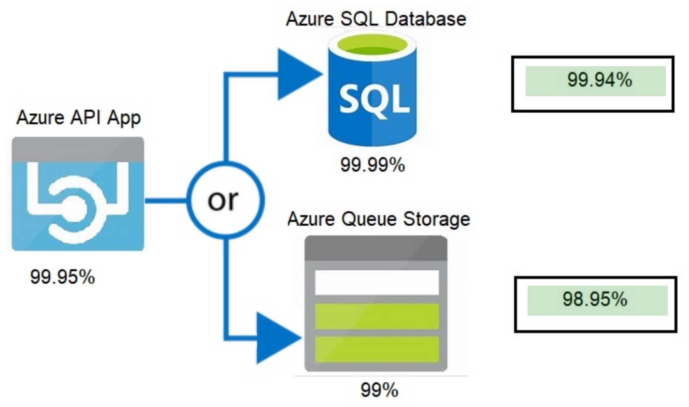

# Azure fundamentals

Modules:

1. [Cloud Concepts - Principles of cloud computing](#cloud-concepts---principles-of-cloud-computing-home)
1. [Introduction to Azure](#core-cloud-services---introduction-to-azure-home)
1. [Azure architecture and service guarantees](#core-cloud-services---azure-architecture-and-service-guarantees-home)
1. [Create an Azure account](#create-an-azure-account-home)
1. [Manage services with the Azure portal](#core-cloud-services---manage-services-with-the-azure-portal-home)
1. [Azure compute options](#core-cloud-services---azure-compute-options-home)
1. [Azure data storage options](#core-cloud-services---azure-data-storage-options-home)
1. [Azure networking options](#core-cloud-services---azure-networking-options-home)
1. [Security, responsibility and trust in Azure](#security-responsibility-and-trust-in-azure-home)
1. [Apply and monitor infrastructure standards with Azure Policy](#apply-and-monitor-infrastructure-standards-with-azure-policy-home)
1. [Control and organize Azure resources with Azure Resource Manager](#control-and-organize-azure-resources-with-azure-resource-manager-home)
1. [Predict costs and optimize spending for Azure](#predict-costs-and-optimize-spending-for-azure-home)
1. [Recap: Hierarchy of infrastructure](#recap-hierarchy-of-infrastructure)
1. ["Bonus": Areas not covered in modules](#bonus-areas-not-covered-in-modules)

## Cloud Concepts - Principles of cloud computing ([home](#))

### What is cloud computing?

**Cloud computing**: renting resources, like storage space or CPU cycles, on another company's computers.

- The company providing these services is referred to as a **cloud provider**

### Categories of computing services

1. Compute power - such as Linux servers or web applications
1. Storage - such as files and databases
1. Networking - such as secure connections between the cloud provider and your company
1. Analytics - such as visualizing telemetry and performance data

### Benefits of cloud computing

- Pay-as-you-go (consumption-based pricing model)
- Scalable: increase or decrease the resources and services used based on the demand or workload at any given time
    - **Vertical scaling** ("scaling up"): adding resources to increase the power of an existing server. Some examples of vertical scaling are: adding more CPUs, or adding more memory.
    - **Horizontal scaling** ("scaling out"): adding more servers that function together as one unit. For example, you have more than one server processing incoming requests.
- Fault tolerant: includes data backup, disaster recovery, and data replication services
- Secure
- **Economies of scale**: cloud providers leverage economies of scale and (theoretically) pass savings on to consumer
    - A cloud service provider's _cost per subscriber_ is reduced as the number of subscribers grows

### Cloud economics

| Term | Meaning |
| ---- | ------- |
| Resiliency | The ability of a system to recover from failures and continue to function |
| Availability | The time that a system is functional and working |
| Scalability | The ability to increase workload resource support _without performance loss_ through resources provided to meet peak demands |
| Agility | The ability to respond quickly to changes in resource requirements\* |
| Disaster recovery | The ability to return to operational state after a failure or loss |
| Fault tolerance | The ability of a system to remain operational after a critical failure |

<sup>\*This does *not* preclude the possibility of an impact to performance, unlike scalability.</sup>

### Forms of spending

| Type | Cost | Examples |
| ---- | ---- | -------- |
| On-prem | **Capex** | Server costs; Storage costs; Network costs; Backup and archive costs; Organization continuity and disaster recovery costs; Data center infrastructure costs; Technical personnel |
| Cloud | **Opex** | Leasing software and customized features; Scaling charges based on usage/demand instead of fixed hardware or capacity; Billing at the user or organization level |

### Cloud deployment models

1. **Public cloud**: All hardware is provided by the cloud provider
    - Cheap and scalable
2. **Private cloud**: Cloud environment hosted in your own data center, offering simulation of public cloud to users in your organization
    - More control, but organization is responsible for purchase and maintenance
    - Private clouds still afford the scalability and efficiency of a public cloud
    - Requires access to be limited to one tenant
3. **Hybrid cloud**: Combines public and private clouds, allowing you to run your applications in the most appropriate location
    - Example: Host a website in the public cloud and link it to a highly secure database hosted in your private cloud
    - **Cloud bursting**: internal resources meet most needs, but cloud-based resources can be added to help support peak use times

### Types of cloud services

1. **Infrastructure as a service (IaaS)**: rented computing infrastructure (hardware), provisioned and managed over the Internet
    - Example: Azure VM, SQL Server 2016
    - IaaS _simulates hardware_
1. [**Platform as a service (PaaS)**](https://azure.microsoft.com/en-us/overview/what-is-paas/): provides an environment for building, testing, and deploying software applications without requiring the user to manage the infrastructure
    - Example: Azure SQL Database, Azure API Management, Azure App Service, Azure Container Instances, IoT Hub
1. [**Software as a service (SaaS)**](https://azure.microsoft.com/en-us/overview/what-is-saas/): software that is centrally hosted and managed for the end customer, usually subscription-based
    - Examples: Office 365, Skype, and Dynamics CRM Online, enterprise resource planning (ERP), Azure IoT Central, Skype


## Core Cloud Services - Introduction to Azure ([home](#))

**Azure**: Microsoft's cloud computing platform.

**Virtualization** separates the tight coupling between hardware and OS using a **[hypervisor](https://en.wikipedia.org/wiki/Hypervisor)**.  Each true server in a cloud provider's data center has a hypervisor.
The hypervisor emulates a real computer and its CPU.  A hypervisor can run multiple VMs.

Tour of Azure services:

> https://docs.microsoft.com/en-us/learn/modules/welcome-to-azure/3-tour-of-azure-services

### Azure Cloud Shell

- **Azure Cloud Shell**: a browser-based command-line experience for managing and developing Azure resources
    - Requires an Azure Storage account
- **Azure CLI**: Azure command-line interface, which is accessible via Cloud Shell or a regular shell

## Core Cloud Services - Azure architecture and service guarantees ([home](#))

### Data centers, Regions, and Geographies

Microsoft Azure is made up of on-the-ground **data centers** located around the globe.  Azure resources use physical equipment located in secure data centers.

The specific data centers aren't exposed to end users directly; instead, Azure organizes them into regions.  (You deploy your app to a region, not a data center.)

A **region** is a geographical area on the planet containing _at least one_, but potentially multiple data centers that are nearby and networked together with a low-latency network.


Special region:

- US DoD Central, US Gov Virginia, US Gov Iowa: Physical and logical network-isolated instances of Azure for US government agencies and partners
    - Operated by screened US persons and include additional compliance certifications
- China East, China North: Available through a unique partnership between Microsoft and 21Vianet
    - Microsoft does not directly maintain the data centers

[Azure Germany](https://azure.microsoft.com/en-us/global-infrastructure/germany/): a physically isolated Azure instance that meets strict EU requirements.

- Controlled by a German data trustee
- Designed for organizations doing business in Germany and the EU that need a high level of security and compliance
- Requires a separate account and has a distinct pricing structure

**Data residency**: physical or geographic location of an organization's data or information. It defines the legal or regulatory requirements imposed on data based on the country or region in which it resides and is an important consideration when planning out your application data storage.

Geographies are broken up into the following areas:

- Americas
- Europe
- Asia Pacific
- Middle East and Africa

### Availability Zones

**Availability Zone**: a cluster of data centers within an Azure region that is physically separate from other zones.

- Each Availability Zone is made up of _one or more_ data centers equipped with independent power, cooling, and networking. It is set up to be an isolation boundary
- For a region to formally support Availability Zones, it must have a _minimum of 3 zones_
- You can use Availability Zones to run mission-critical applications and build high-availability into your application architecture by co-locating your compute, storage, - networking, and data resources within a zone
- Availability Zones are primarily for VMs, managed disks, load balancers, and SQL databases
- Each Availability Zone is a separate fault and update zone and has very low latency with other availability zones in the region

### Region Pairs

Region pairs: The pairing of two Azure regions, which are at least 300 miles away but within the same geography, as a means of resiliency.

- Regions are _always_ paired with at least one other region.

### Service-Level Agreements (SLAs)

SLA: captures the specific terms that define the performance standards that apply to Azure.

- A "what you can expect" contract
- SLAs also specify what happens if a service or product fails to perform to a governing SLA's specification
- Free services (e.g. Container Registry, Azure Advisor, Azure Policy) do _not_ have a financially-backed SLA
- Full list: [SLA summary for Azure services](https://azure.microsoft.com/en-us/support/legal/sla/summary/)

Characteristics of Azure SLAs:

1. Performance Targets: specific to each Azure product and service, such as uptime or connectivity rates
1. Uptime and Connectivity Guarantees: typically range from 99.9 percent ("three nines") to 99.999 percent ("five nines")
1. Service credits: typically applied when an Azure product under-performs

**Composite SLA**: an SLA that represents SLAs combined across different service offerings

- Combined probability of failure is higher than the individual SLA values if applications are dependent
- Example: 99.95 % (SLA 1) × 99.99 % (SLA 2) = 99.94 % (Composite SLA)



**Application SLA**: an SLA created by you the developer in the interest of setting a performance target for your application.

- High availability and disaster recovery are two crucial components of resiliency
- When designing your architecture you need to design for resiliency, and you should perform a Failure Mode Analysis (FMA)

## Create an Azure account ([home](#))

### Identities, accounts and subscriptions

**Identity**: any _thing_ that can be authenticated---a user, app, or service.

**Azure account**: an identity that has data associated with it.

Every Azure account is associated with one or more Azure subscriptions.

**Azure subscription**: a logical container used to provision resources in Azure.

The subscription is used to pay for Azure cloud services. You can have multiple subscriptions under one account, and they're linked to a credit card.

Subscription types:

- Free
    - Includes $200 credit that you can use with any service for 30 days
    - Provides free access to Azure services for 12 months
- Pay-As-You-Go (PAYG): charges you monthly for the services you used in that billing period
- Enterprise Agreement
- Student

### Using multiple subscriptions under one account

Creating multiple subscriptions under one account is particularly useful for businesses because _access control and billing occur at the subscription level_, not the account level.

- Access management: you could, for example, limit engineering to lower-cost resources, while allowing the IT department a full range
- A single bill is generated for every Azure subscription on a monthly basis
- You can set spending limits on each subscription
- Many large organizations buy their Azure subscriptions through Enterprise Agreements (EAs)
- It is possible to transfer Azure subscriptions between accounts

### Authentication, Azure AD, and tenants

[**Active Directory (AD)**](https://en.wikipedia.org/wiki/Active_Directory) is a directory service that predates Azure.  At a high level, it refers to "a broad range of directory-based identity-related services."

The more specific [**Azure Active Directory (Azure AD)**](https://docs.microsoft.com/en-us/azure/active-directory/fundamentals/active-directory-whatis) is a modern _identity provider_ that supports multiple authentication protocols to secure applications and services in the cloud.

It provides:

- Single sign-on (SSO)
- Multi-factor authentication (MFA)

When you sign up for a Microsoft cloud service subscription such as Microsoft Azure, Microsoft Intune, or Office 365, a dedicated instance of Azure AD is automatically created for your organization.

More specifically, this instance is an Azure AD **tenant**: a dedicated, isolated instance of the Azure Active Directory service, commonly associated with companies. If you sign up for Azure with an email address that's not associated with an existing tenant, the sign-up process will walk you through creating a tenant, owned entirely by you.

Azure AD tenants and subscriptions have a **one-to-many trust relationship**:

> A tenant can be associated with multiple Azure subscriptions, but every subscription is associated with only one tenant.
>
> A subscription can be owned by exactly one account.  That account becomes part of an AD tenant.  Many users (accounts) can be members of the tenant, but only one account can own a subscription.

Each Azure AD tenant has an account owner.

See also: [Azure AD terminology](https://docs.microsoft.com/en-us/azure/active-directory/fundamentals/active-directory-whatis#terminology).

### Azure Support

The support plans available and how you're charged depends on the type of Azure customer you are, and the type of Azure subscription you have:

1. Developer (least expensive):
    - Business hours access to email support
    - Response time: <8 business hours
1. Standard:
    - 24x7 access to email + phone support
    - Response time: <1 hour
1. Professional direct:
    - Azure Engineering-led web seminars
1. Premier (most expensive):
    - Designated Technical Account Manager provides proactive guidance

Full table [Azure support options](https://docs.microsoft.com/en-us/learn/modules/create-an-azure-account/6-support-options).

## Core Cloud Services - Manage services with the Azure portal ([home](#))

### Azure management options

**Azure portal**: a public website that you can access with any web browser.

- https://portal.azure.com/
- Customizable via drag-and-drop
- Doesn't provide any way to automate repetitive tasks

[**Azure PowerShell**](https://docs.microsoft.com/en-us/powershell/): a module that you can install for Windows PowerShell or PowerShell Core.

[**Azure Command-Line Interface (CLI)**](https://docs.microsoft.com/en-us/cli/azure/?view=azure-cli-latest): a cross-platform command-line program that connects to Azure and executes administrative commands on Azure resources.

- Can be run on Windows, Linux, or macOS
- Sign in via `az login`

**Azure Cloud Shell**: an interactive, authenticated, browser-accessible shell for managing Azure resources.

- Allows Bash or PowerShell (shells), and both support the Azure CLI and Azure PowerShell module
- Has a suite of developer tools, text editors, and other tools available (git, vim, Python)

**Azure mobile app**: allows you to access, manage, and monitor all your Azure accounts and resources from your iOS or Android phone or tablet.

[**SDKs**](https://azure.microsoft.com/en-us/downloads/): collections of libraries for .NET, Java, JavaScript, and Python.

### Using Azure Portal

The Azure portal uses a **blades model** for navigation. A blade is a slide-out panel containing the UI for a single level in a navigation sequence. For example, each of these elements in this sequence would be represented by a blade: Virtual machines > Compute > Ubuntu Server.

**Azure Marketplace**: allows customers to find, try, purchase, and provision applications and services that are certified to run on Azure.  Example: open-source container platforms, virtual machine images, databases, application build and deployment software, developer tools, threat detection, and blockchain.

**Azure Advisor**: a free service built into Azure that provides recommendations on high availability, security, performance, and cost.

### Azure Portal dashboards

**Dashboard**: a customizable collection of UI tiles displayed in the Azure portal.

- You add, remove, and position tiles to create the exact view you want, and then save that view as a dashboard
- Multiple dashboards are supported, and you can switch between them as needed
- Dashboards are stored as JSON files
- Azure stores dashboards within resource groups, just like virtual machines or storage accounts that you can manage within the portal
- When you define a new dashboard, it is private and visible only to your account. To make it visible to others, you need to share a dashboard. However, as with any other Azure resource, you need to specify a new resource group (or use an existing resource group) in which to store shared dashboards

### Preview features

**Azure Preview Features**: you can test beta and other pre-release features, products, services, software, and regions.

- **Private Preview**: feature is available to specific Azure customers for evaluation purposes
- **Public Preview**: feature is available to all Azure customers for evaluation purposes (feedback)

Other points:

- SLAs do _not_ apply to previews
- Access to preview features can be configured at the organization or user level
- Access to preview features can be revoked by Microsoft at any time without prior notice

**General Availability (GA)**: when a feature has been released to customers as part of Azure's default product set.

## Core Cloud Services - Azure compute options ([home](#))

### Azure compute concepts

There are four common techniques for performing compute in Azure:

1. **Virtual machines**: software emulations of physical computers
    - Each VM includes an operating system and hardware that appears to the user like a physical computer
1. **Containers**: a virtualization environment for running applications
    - Unlike VMs, containers don't include an operating system for the apps running inside the container. Instead, containers bundle the libraries and components needed to run the application and use the existing host OS running the container.
1. **Azure App Service**: a platform-as-a-service (PaaS) offering in Azure that is designed to host enterprise-grade web-oriented applications
1. **Serverless computing**: a cloud-hosted execution environment that runs your code but completely abstracts the underlying hosting environment
    - Run application code without creating, configuring, or maintaining a server. The application is broken into separate functions that run when triggered by some action
    - With serverless, you only pay for processing time.  With VMs/containers, you're charged while they're running

### Azure VMs and Scaling

**Image**: a template used to create a VM. These templates already include an OS and often other software, like development tools or web hosting environments.

Features for scaling Azure VMs:

- **Availability sets**: a logical grouping of two or more VMs that help keep your application available during planned or unplanned maintenance
    - Do not confuse with Availability Zones; availability sets are _separate deployments in the same data center_
- **Virtual Machine Scale Sets**: let you create and manage a group of identical, load balanced VMs, without configuring a load balancer
    - Scale Sets enable **autoscaling**
    - Automatically creates and integrates with Load Balancer or Application Gateway
    - Automatic distribution over Availability Sets and Availability Zones (but *not* Regions)
- **Azure Batch**: scale to many VMs; enables large-scale job scheduling and compute management
    - Difference from Scale Sets: Azure Batch is a PaaS focused on running large scale batch jobs

### Containers

**Container**: a modified runtime environment built on top of a host OS that executes your application.

- More lightweight than VMs; dependencies installed automatically
- Run multiple apps in a single container
- Can be accessed over the Internet by IP address or domain name, just like a VM

Azure supports Docker containers (a standardized container model):

- **Azure Container Instances** (ACI) - a PaaS offering that allows you to upload your containers and execute them directly
- **Azure Kubernetes Service** (AKS) - a complete orchestration\* service for containers with distributed architectures with multiple containers
    - You _deploy_ containers to a Kubernetes cluster

<sup>\***Orchestration**: The task of automating, managing, and interacting with a large number of containers</sup>

### Microservices

**Microservice**: Simplify application architecture by creating more focused, autonomous, and independently managed web services that address a single business domain or capability.

Containers are often used to create solutions using a microservice architecture. This architecture is where you break solutions into smaller, independent pieces.

Factors that call for microservices:

- High release velocity
- Highly scalable
- Rich domains
- Small development teams

### App Service

- Supports both Windows and Linux
- Enables automated deployments from GitHub, Azure DevOps, or any Git repo to support a continuous deployment model
- Cost: You pay for the Azure compute resources your app uses while it processes requests based on the App Service Plan you choose

Types of apps:

- **Web Apps**: Traditional web apps built using a handful of languages
- **API Apps**: REST-based Web APIs using your choice of language and framework; Swagger support and published API in Azure Marketplace
- **WebJobs**: Run a program or script in the same context as a web app
- **Mobile Apps**: Backend for iOS and Android apps

Factors influencing App Service cost:

- _Instance type_: the size of the VM that hosts the application
- _Number of instances_: the amount of VMs that host the web app
- _OS_: Linux is a bit cheaper than Windows
- _Region_: where the VM(s) is deployed
- _Tier_: whether you want a shared VM or isolated VM

### Serverless

Serverless computing encompasses three ideas:

- **Abstraction of servers**: the cloud provider takes care of managing the server infrastructure and allocation/deallocation of resources based on demand
- **Event-driven scale**: workloads that respond to incoming events
- **Micro-billing**: pay only for the time your code runs

**Azure Functions**: "pure code" without dependence on underlying platform or infrastructure; trigger logic based on an event.

- Can be either **stateless** (the default) where they behave as if they're restarted every time they respond to an event), or **stateful** (called "Durable Functions") where a context is passed through the function to track prior activity

**Azure Logic Apps**: execute **workflows** (rather than code) designed to automate business scenarios that start with a trigger.

- You create Logic App workflows using a visual designer on the Azure portal or in Visual Studio
- The workflows are persisted as a JSON file with a known workflow schema
- You _cannot_ use code to develop a Logic app

**Orchestration**: a collection of functions or steps that are executed to accomplish a complex task.

- Can be created by both Azure Functions and Logic Apps

Functions versus Logic Apps:

| Attribute | Functions | Logic Apps |
| --------- | --------- | ---------- |
| State |   Normally stateless, but Durable Functions provide state  |   Stateful |
| Development |     Code-first (imperative)   |  Designer-first (declarative) |
| Connectivity |    About a dozen built-in binding types, write code for custom bindings  |  Large collection of connectors, Enterprise Integration Pack for B2B scenarios, | build custom connectors |
| Actions |     Each activity is an Azure function; write code for activity functions  | Large collection of ready-made actions |
| Monitoring |  Azure Application Insights | Azure portal, Log Analytics |
| Management |  REST API, Visual Studio   |  Azure portal, REST API, PowerShell, Visual Studio |
| Execution context | Can run locally or in the cloud   |  Runs only in the cloud |

Both Functions and Logic Apps:

- Can run on a schedule (time trigger)
- Can act as a web hook (HTTP trigger)

## Core Cloud Services - Azure data storage options ([home](#))

### Introduction

Benefits of cloud storage:

- Automated backup and recovery
- Replication across the globe
- Support for data analytics
- Encryption capabilities
- Multiple data types
- Data storage in virtual disks
- Storage tiers

Types of data that Azure storage is designed to hold:

1. **Structured (relational) data**: Adheres to a schema, stored in relational database
1. **Semi-structured data**: non-relational or NoSQL data
1. **Unstructured data**: completely unstructured, no restrictions on the kinds of data it can hold

### Storage options overview

- **Azure SQL Database**: a relational database as a service (DaaS) based on the latest stable version of the Microsoft SQL Server database engine
    - **Azure Database Migration Service**: used to migrate your existing SQL Server databases with minimal downtime
    - Lets you access data from a SQL Server database engine without needing to deploy a VM
- **Azure Cosmos DB**: a globally distributed database service
    - Supports schema-less data (key-value and document data models) that lets you build highly responsive and Always On applications to support constantly changing data
    - Accessed via SQL queries, or also supports NoSQL
    - Can be stored as JSON
- **Azure Blob Storage**: unstructured, meaning that there are no restrictions on the kinds of data it can hold
    - Blobs behave largely like files on a disk when it comes to reading and writing data
    - Commonly used for logs, audio/video data, scientific data, disaster recovery
    - Lets you stream large video or audio files directly to the user's browser
- **Azure Data Lake Storage**: a large repository that stores both structured and unstructured data
- **[Azure Data Lake Analytics](https://docs.microsoft.com/en-us/azure/data-lake-analytics/data-lake-analytics-overview)**: allows you to perform analytics on your data usage and prepare reports
    - Uses U-SQL, a query language that extends the familiar, simple, declarative nature of SQL with the expressive power of C#
    - Dynamic scaling: pay only for the processing power used
- **Azure Files** ("file storage"): offers fully managed file shares in the cloud that are accessible via Server Message Block (SMB) protocol
    - Provides access to other VMs and on-prem resources
- **Azure Queue**: storage service for storing large numbers of messages
    - Provides asynchronous message queuing for communication between application components, whether they are running in the cloud, on the desktop, on-premises, or on mobile devices.
- **Azure Disk storage**: stores data as an attached virtual hard disk (VHD) that is available to the VM to which the disk is attached
    - Does not provide outside access (besides the VM)
    - The disks can be managed or unmanaged by Azure, and therefore managed and configured by the user
    - You are storing data that is not required to be accessed from outside the virtual machine to which the disk is attached
    - Offers both solid-state drives (SSDs) and traditional spinning hard disk drives (HDDs)

Read more: [Deciding when to use Azure Blobs, Azure Files, or Azure Disks](https://docs.microsoft.com/en-us/azure/storage/common/storage-decide-blobs-files-disks).

Tiers for blob object storage:

- **Hot storage tier**: optimized for storing data that is accessed frequently
- **Cool storage tier**: optimized for data that are infrequently accessed and stored for at least 30 days
- **Archive storage tier**: for data that are rarely accessed and stored for at least 180 days with flexible latency requirements

Encryption for storage services:

- **Client-side encryption**: data is already encrypted by the client libraries. Azure stores the data in the encrypted state at rest
- Azure Storage Service Encryption (SSE): server-side encryption done by Azure
    - Encrypts the data before storing it and decrypts the data before retrieving it
    - Transparent to the user

**Replication for storage**: a replication type is set up when you create a storage account.

### Comparison between Azure data storage and on-premises storage


## Core Cloud Services - Azure networking options ([home](#))

**Loosely coupled architecture**: system in which each component has, or makes use of, little or no knowledge of the definitions of other separate components.

**N-tier architecture**: divides an application into two or more logical tiers.

- A higher tier can access services from a lower tier, but a lower tier should never access a higher tier
- Tiers help separate concerns and are designed to be reusable
- Simplifies maintenance
- New tiers can be inserted if needed

Typical design:

- All tiers (parts) sit in the same Azure region and the same virtual network, but in separate subnets
    - Subnet: a logical subdivision of an IP network
    - Computers that belong to a subnet are addressed with an identical most-significant bit-group in their IP addresses
- The user-facing tier has a public and private IP addresses, while other deeper tiers are accessible only via their private IP
- Virtual networks are configured through software

**Network security group** (NSG): allows or denies inbound network traffic to your Azure resources.

- Restricts communication between virtual machines by source and destination IP address, port, and protocol
- A cloud-level firewall for your network

### Azure Load Balancer

**Availability**: how long your service is up and running without interruption.

**High availability**: a service that's up and running for a long period of time.

**Resiliency**: a system's ability to stay operational during abnormal conditions.

**Load balancer**: distributes traffic evenly among each system in a pool, helping you achieve high availability.

- The load balancer becomes the entry point to the user
- Multiple VMs (or another resource) sit in a single tier and the load balancer distributes incoming requests between them
- Enables you to run maintenance tasks without interrupting service. (For example, you can stagger the maintenance window for each VM)

**Azure Application Gateway**: a load balancer designed for HTTP web applications.

- Uses Azure Load Balancer at the transport level (TCP)
- Applies sophisticated URL-based routing rules to support several advanced scenarios (application layer/OSI layer 7 load balancing)
    - For example, route `/images` to one pool of VMs, and `/videos` to another cluster
- Benefits:
    - **Cookie affinity**: Useful when you want to keep a user session on the same backend server
    - **SSL termination**. Manages your SSL certificates and passes unencrypted traffic to the backend servers to avoid encryption/decryption overhead
    - **Web application firewall**. Application gateway supports a sophisticated firewall (WAF) with detailed monitoring and logging to detect malicious attacks against your network infrastructure
    - **URL rule-based routes**. Application Gateway allows you to route traffic based on URL patterns, source IP address and port to destination IP address and port. This is helpful when setting up a content delivery network
    - **Rewrite HTTP headers**. You can add or remove information from the inbound and outbound HTTP headers of each request to enable important security scenarios, or scrub sensitive information such as server names

**Content delivery network (CDN)**: a distributed network of servers that delivers web content to users with minimal latency.

- Typical usage scenarios include web applications containing multimedia content

**Azure DNS**: a hosting service for DNS domains that runs on Azure infrastructure

- You can bring your own DNS server or use **Azure DNS**
- For example, if you're using Azure DNS and have a load balancer serving contoso.com, Azure DNS routes traffic to the load balancer

### Azure Traffic Manager: reducing latency

A load balancer achieves high availability.  It does _not_ decrease latency or create resiliency across geographic regions.

**Latency**: the time it takes for data to travel over the network.

- Typically measured in milliseconds
- Most heavily influenced by _distance_

**Azure Traffic Manager**: uses the DNS server that's closest to the user to direct user traffic to a globally distributed endpoint.

- Doesn't see the traffic that's passed between the client and server. Rather, it directs the client web browser to a preferred endpoint
- Used when multiple copies of your underlying service are deployed to more than one region


Comparison between _Load Balancer_ vs _Application Gateway_ vs _Traffic Manager_:

> Only Traffic Manager deals with and optimizes for latency vis-a-vis locality.

## Security, responsibility and trust in Azure ([home](#))

### Key concepts

As you move across the spectrum from IaaS to PaaS to SaaS, the burden of security falls more heavily on Azure rather than you the user.

Regardless of the deployment type, you always retain responsibility for the following:

1. Data
1. Endpoints
1. Accounts
1. Access management

**Defense in depth**: a layered approach to security where eaach layer provides protection so that if one layer is breached, a subsequent layer is already in place to prevent further exposure.

- Designed to slow the advance of an attack

### Azure Security Center

**Azure Security Center**: a monitoring service that provides threat protection.

- Provides security recommendations based on your configurations, resources, and networks
- Monitor security settings across on-premises and cloud workloads
- Use machine learning to detect and block malware from being installed
- Provide just-in-time access control for ports
- Part of the Center for Internet Security (CIS) recommendations

Available in two tiers:

1. Free: available as part of your Azure subscription
    - Limited to assessments and recommendations of Azure resources only
1. Standard: full suite
    - Continuous monitoring, threat detection, just-in-time access control for ports
    - To upgrade, you must be assigned the role of Subscription Owner, Subscription Contributor, or Security Admin

Response stages:

1. Detect: Review the first indication of an event investigation
1. Assess: obtain more information about the suspicious activity
1. Diagnose: identify containment, mitigation, and workaround strategies

### Identity and access

[**Identity management**](https://en.wikipedia.org/wiki/Identity_management), which is the proper authentication and assignment of privileges, has become the new primary security boundary.

- **Authentication**: establishing the identity of a person or service looking to access a resource
    - Ensures the user/PW combination is correct
    - Establishes whether or not people are who they say they are
- **Authorization**: establishing what level of access an authenticated person or service has
    - Authorization is _verifying that an authenticated user has access to certain functions_

Components/types of authorization:

- Self-service password reset (SSPR), multi-factor authentication (MFA), custom banned password list, smart lockout services
- MFA: requires _two or more_ elements for full authentication
    - **Something you know**: a password, PIN (i.e. at the ATM), or the answer to a security question
    - **Something you possess**: a mobile app that receives a notification or a token-generating device
    - **Something you are**: a fingerprint or face scan used on many mobile devices (biometrics)
- Increases security of your identity by limiting the impact of credential exposure
- Single-Sign-On (SSO): enables users to remember only one ID and one password to access multiple applications
    - Philosophy: "More identities mean more passwords to remember and change"
- Application management
- Business to business (B2B) identity services: manage guest users and external partners
- Device Management: manage how devices access your corporate data

Authentication types that support both SSPR and MFA:

- Password
- SMS
- Voice call

#### MFA servers and AD FS

_TODO: this section may be outdated._

An **MFA server** is required for authentication when supporting users located on on-premises AD only.

Azure MFA Service (Cloud) supports authentication for users located on Azure AD only.

See also:

- [Getting started with the Azure Multi-Factor Authentication Server](https://docs.microsoft.com/en-us/azure/active-directory/authentication/howto-mfaserver-deploy)
- [How it works: Azure Multi-Factor Authentication](https://docs.microsoft.com/en-us/azure/active-directory/authentication/concept-mfa-howitworks)
- [Active Directory Federation Services](https://docs.microsoft.com/en-us/windows-server/identity/active-directory-federation-services)
- [Active Directory Federation Services (AD FS) ](https://searchmobilecomputing.techtarget.com/definition/Active-Directory-Federation-Services-AD-Federation-Services)

#### Providing identities to services

How can you give a service an identity without putting that identity in a plaintext configuration file?

Azure has two options for this:

- **Service principals**: an identity that is used by a service or application
    - Based off the concept of a **principal**,  is an identity acting with certain (expanded) roles or claims
- **Managed identities for Azure services**: an account created on your Active Directory Tenant, where the Azure infrastructure will automatically take care of authenticating the service and managing the account

#### Role-based access control (RBAC)

**Role**: a set of permissions, like "Read-only" or "Contributor," that users can be granted to access an Azure service instance.

> Role-based access control (RBAC) provides _fine-grained_ access management for Azure resources, enabling you to grant users only the rights they need to perform their jobs. RBAC is provided at no additional cost to all Azure subscriber.

RBAC examples:

- Allow one user to manage VMs in a subscription, and another user to manage virtual networks
- Allow a database administrator (DBA) group to manage SQL databases in a subscription
- Allow a user to manage all resources in a resource group, such as VMs, websites, and virtual subnets
- Allow an application to access all resources in a resource group

Built-in roles: Azure RBAC includes over 70 built-in roles. There are four fundamental RBAC roles:

1. **Owner**: Has full access to all resources including the right to delegate access to others
1. **Contributor**: Can create and manage all types of Azure resources but _cannot grant access to others_
1. **Reader**: Can view existing Azure resources; cannot make changes
1. **User Access Administrator**: Lets you manage user access to Azure resources

Use the **Access control (IAM)** panel to view, grant, or remove access.

- RBAC uses an **allow model** for access, a _default-deny-and-explicit-allow system_
- If one role assignment grants you read permissions to a resource group, and a different role assignment grants you write permissions to the same resource group, you will have write permissions on that resource group

**Azure Resource Manager hierarchy**: Roles assigned at a higher scope, like an entire subscription, are inherited by child scopes, like service instances.

**Azure AD Privileged Identity Management (PIM)**: provides access reviews, oversight of role assignments, self-service, and just-in-time role activation.

### Encryption

**Encryption**: the process of making data unreadable and unusable to unauthorized viewers.

Two top-level types of encryption:

1. **Symmetric encryption**: uses the same key to encrypt and decrypt the data.
    - Example: Advanced Encryption Standard (AES)
1. **Asymmetric encryption**: uses a public key and private key pair
    - Either key can encrypt but both keys are required for decryption
    - Used for things like Transport Layer Security (TLS) (used in HTTPS) and data signing

Encryption is typically approached in two ways:

1. **Encryption at rest**: encrypted data stored on a physical medium.
1. **Encryption in transit**: data encrypted when it is actively moving from one location to another.
    - Could be encrypted at several different layers, such as application layer (ex: HTTPS), or network layer (VPN)

#### Encryption on Azure

- **Azure Storage Service Encryption**: encryption at rest for Azure services
    - Automatically encrypts your data before persisting it to Azure Managed Disks, Azure Blob storage, Azure Files, or Azure Queue storage, and decrypts the data before retrieval.
- **Azure Disk Encryption**: encrypts Windows and Linux IaaS virtual machine disks
    - Uses BitLocker (Windows) or dm-crypt (Linux)
    - Ensures that the [virtual hard disk (VHD)](https://docs.microsoft.com/en-us/azure/virtual-machines/windows/managed-disks-overview) is encrypted, not just the physical disk (as encrypted by Storage Service Encryption)
- **Azure Key Vault**: a secrets manager---centralized cloud service for storing your application secrets
    - Includes ability to provision, manage, and deploy SSL/TLS certificates

### Azure certificates

Two purposes of certificates in Azure:

1. **Service certificates**: used for cloud services
    - Attached to cloud services and enable secure communication to and from the service
    - Can be managed separately from your services
1. **Management certificates**: used for authenticating with the management API
    - Not really related to cloud services

### Network protection

**Azure Firewall**: a service that grants server access based on the originating IP address of each request.

- Fully stateful firewall as a service with built-in high availability and unrestricted cloud scalability
- Provides inbound protection for non-HTTP/S protocols (SSH, FTP, SSH)
- Rules typically also include specific network protocol and port information
- You could use Firewall to filter traffic between:
    - Virtual subnets
    - Azure and an on-premises deployment

**Azure Application Gateway**: a load balancer that includes a Web Application Firewall (WAF)

**Azure DDoS Protection**: identifies DDos, blocks further traffic from reaching Azure services without interrupting legitimate customers

- Provides both _Basic_ and _Standard_ service tiers
    - Basic: enabled automatically as part of Azure platform
    - Standard: with additional subscription, protects against volumetric, protocol, and application layer attacks
- Notifies you of attack detection via Azure Monitor metrics
- Multiple VMs can link to the same DDoS Protection plan

**Network Security Groups (NSGs)**: restrict communication between virtual machines by source and destination IP address, port, and protocol.

What is the difference between an NSG and Firewall?

> Use Azure Firewall to restrict network traffic _across subscriptions_.  Use an NSG to allow inbound traffic to a single VM from specific IPs.  (You associate an NSG with a subnet, which is part of a VNet, and in turn VMs are attached to a VNet.)

**Azure ExpressRoute**: provides a dedicated, private connection between your private network and Azure.

- Lets you extend your on-premises networks into the Microsoft cloud over a private connection facilitated by a connectivity provider

**Microsoft Azure Information Protection** (AIP): classifies and optionally protects documents and emails by applying labels.

- Labels can be applied automatically based on rules and conditions, manually, or a combination of both where users are guided by recommendations
- You can track and control how the content is used after it is classified/labeled: for example, track access to documents

**Azure Advanced Threat Protection (Azure ATP)**: identifies, detects, and helps you investigate advanced threats, compromised identities, and malicious insider actions directed at your organization.

- Azure ATP portal: ATP has its own portal separate from the Azure portal, https://portal.atp.azure.com
- Azure ATP sensor: installed directly on your domain controllers
- Azure ATP cloud service: connected to Microsoft's intelligent security graph

### Application lifecycle management: security considerations

**Microsoft Security Development Lifecycle (SDL)**: introduces security and privacy considerations throughout all phases of the development process.

- Provide training: security is everyone's job
- Define and update security requirements
- Tracking: properly label security defects and security work items
- Perform threat modeling
- Establish design requirements
- Define and use cryptography standards
- Manage security risks from using third-party components
- Define and publish a list of approved tools and their associated security checks
- Static analysis: analyze source code prior to compilation
    - Integrate Static Analysis Security Testing (SAST) into the commit pipeline
- Dynamic analysis: run-time verification of your fully compiled or packaged software
    - Monitor application behavior for memory corruption, user privilege issues, and other critical security problems
- Perform penetration testing
- Establish a standard incident response process

## Apply and monitor infrastructure standards with Azure Policy ([home](#))

### Overview

**Azure Policy**: service to create, assign and, manage IT policies to enforce different rules and effects over your resources

Example: ensure that all resources have the `Department` tag associated with them.

Azure Policy versus RBAC: a Policy is assigned to a _scope_, such as a resource group; RBAC assigns permissions to _users and groups_

- RBAC focuses on _user actions_ at different scopes
- Azure Policy focuses on _resource properties_ during deployment and for already-existing resources
- Unlike RBAC, Azure Policy is a _default-allow-and-explicit-deny system_

| Scenario | Resource or Policy |
| -------- | ------------------ |
| You want to ensure that only SQL Database instances can be added to a resource group named `database-rg` | Policy |
| You want to ensure that only members of the Sales group can access VMs in the `sales-rg` resource group | RBAC |
| You want to prevent new resources from being added to a resource group by anyone | Lock |

How to apply a policy:

1. Create a policy definition: expresses what to evaluate and what action to take, represented as a JSON file
1. Assign a definition to a scope of resources: register a provider, such as  `Microsoft.PolicyInsights` extension, and create a policy assignment
    - **Policy assignment**: a policy definition that has been assigned to take place within a specific scope
        - Policy assignments are inherited by all child resources
    - **Policy effects**: dictate what happens when a policy rule is matched
1. View policy evaluation results: use the Azure Portal to spot non-compliant resources
    - Azure Policy can allow a resource to be created even if it doesn't pass validation---this will trigger an audit event

Overview of different policy effects:

| Policy Effect | What happens? |
| ------------- | ------------- |
| Deny |   The resource creation/update fails due to policy. |
| Disabled |   The policy rule is ignored (disabled). Often used for testing. |
| Append | Adds additional parameters/fields to the requested resource during creation or update. A common example is adding tags on resources such as Cost Center or specifying allowed IPs for a storage resource. |
| Audit, AuditIfNotExists |    Creates a warning event in the activity log when evaluating a non-compliant resource, but it doesn't stop the request. |
| DeployIfNotExists |  Executes a template deployment when a specific condition is met. For example, if SQL encryption is enabled on a database, then it can run a template after the DB is created to set it up a specific way. |

### Initiatives

**Initiative definition**: a set or group of policy definitions to help track your compliance state for a larger goal.

- **Initiative assignment**: an initiative definition assigned to a specific scope
- Helps to organize multiple policy definitions

### Enterprise governance management

**Azure Management Group**: container for managing access, policies, and compliance across multiple Azure subscriptions.

- A further level of classification that is above the level of subscriptions

Examples:

- Limit VM locations to US West Region on the group "Infrastructure Team management group"
- Provide user access to multiple subscriptions in one sweep: create one RBAC assignment on the management group

### Azure Blueprint

**Azure Blueprint**: define a repeatable set of Azure resources that implements and adheres to an organization's standards, patterns, and requirements.

- Makes it easier, faster, and safer to stand up new environments within organizational compliance
- Blueprint service is backed by Azure Cosmos DB
- Difference from Azure Policy: a policy can be included in a blueprint

### How Microsoft manages resource security

This section deals with how Microsoft, the cloud provider, manages the underlying resources you are building on.

- **Microsoft Privacy Statement**: explains what personal data Microsoft processes, how Microsoft processes it, and for what purposes
    - Some Microsoft products require personal information or otherwise can't be used
    - Microsoft may share personal information with vendors on Microsoft's behalf
- **Microsoft Trust Center**: a website resource containing information and details about how Microsoft implements and supports security, privacy, compliance, and transparency
- **Service Trust Portal** (STP): the Microsoft public site for publishing audit reports and other compliance-related information relevant to Microsoft’s cloud services
    - You could maintain and track compliance with FedRAMP, GDPR, etc
- **Compliance Manager**: enables you to track, assign, and verify your organization's regulatory compliance activities
    - A workflow-based risk assessment dashboard within the Service Trust Portal (https://servicetrust.microsoft.com)
    - Contains detailed information provided by Microsoft to auditors and regulators
    - Provides a Compliance Score to help you track your progress and prioritize auditing controls

### Monitor your service health

**Azure Monitor**: collect, analyze, and act on on [telemetry](https://en.wikipedia.org/wiki/Telemetry) data from your cloud and on-premises environments.

- Begins collecting data as soon as you add a resource to a new Azure subscription
- Can use autoscale to add or remove resources as appropriate (create rules that use metrics collected by Azure Monitor to determine when to automatically add resources)

Components of Azure Monitor:

- **Application Insights**: monitors the availability, performance, and usage of your web applications
    - An Application Performance Management (APM) service for web developers
    - Visually analyze telemetry data
    - You install a small instrumentation package in your application, which monitors your app and sends telemetry data to Azure Monitor
    - [What does Application Insights monitor?](https://docs.microsoft.com/en-us/azure/azure-monitor/app/app-insights-overview#what-does-application-insights-monitor)
- **Azure Activity Logs**: record when resources are created or modified
- **Metrics**: tell you how the resource is performing and the resources that it's consuming
    - Collected at regular intervals and are identified with a timestamp, a name, a value, and one or more defining labels
    - Stored in a time-series database
- **Azure Monitor for containers**: monitors the performance of container workloads
- **Azure Monitor for VMs**: monitors your Azure VMs at scale
- **Alerts** in Azure Monitor: proactively notify you of critical conditions and potentially attempt to take corrective action

[**Azure Service Health**](https://docs.microsoft.com/en-us/azure/service-health/service-health-overview): provides personalized guidance and support when issues with Azure services affect you.

- Notifies you about Azure service incidents and planned maintenance
- A customizable dashboard that tracks the state of your Azure services in the regions where you use them
- **Health alerts**: integrates with Azure Monitor to alert you via emails, text messages, and WebHook notifications

Service Health tracks 3 event types:

1. **Service issues**: Problems in the Azure services that affect you right now
1. **Planned maintenance**: Upcoming maintenance that can affect the availability of your services in the future
1. **Health advisories**: Changes in Azure services that require your attention
    - When Azure features are deprecated
    - If you exceed a usage quota

**Azure Status**: a global view of the health state of Azure services

- An [outdated version of Service Health](https://docs.microsoft.com/en-us/azure/service-health/azure-status-overview)
- Azure status page gets updated in real time as the health of Azure services change
- **Health history**: view older events; keeps track of inactive events for 90 days
- Reports on service problems that affect a broad set of Azure customers

**Resource Health**: helps you diagnose and obtain support when an Azure service issue affects your resources

- A more personalized dashboard (relative to Azure Status); a more granular view into the health of your specific Azure resources
- Shows all the times that your resources have been unavailable because of Azure service problems

## Control and organize Azure resources with Azure Resource Manager ([home](#))

**Azure Resource Manager**: the deployment and management service for Azure

- Provides a management layer that enables you to create, update, and delete resources in your Azure subscription
- Use access control, locks, and tags, to secure and organize your resources after deployment

**Resource Manager template**: A JSON file that defines one or more resources to deploy to a resource group or subscription

- Used to deploy the resources consistently and repeatedly
- Uses **declarative syntax**
- Difference from Azure Blueprints:
    - A Resource Manager template is a document that doesn't exist natively in Azure
    - Blueprints preserve the definition (what _should_ be deployed) and the assignment (what _was_ deployed); this is not true for a template
    - More detail: [How it's different from Resource Manager templates](https://docs.microsoft.com/en-us/azure/governance/blueprints/overview#how-its-different-from-resource-manager-templates)

### Resource groups

**Resource group**: a logical container for resources deployed on Azure.

- All resources must be in a resource group
- A resource can only be a member of _one_ resource group
- If you delete a resource group, all resources contained within are also deleted
- Function as a scope for applying RBAC permissions
- A resource group sits within a subscription and within a specific region
    - However, a resource group can contain resources that are located in different regions.
- Quotas for resources in Resource Groups are per region rather than per subscription

Use resource groups for organization:

- Consistent naming convention: e.g. `msftlearn-core-infrastructure-rg`
- Organizing principles: by resource type (VMs, DB), purpose (core, helpers), environment (prod, qa, dev), department (marketing, finance, human resources)

### Use tagging to organize resources

**Tags**: name/value pairs of text data that you can apply to resources and resource groups.

- A resource can have up to 50 tags
- The name is limited to 512 characters for all types of resources except storage accounts, which have a limit of 128 characters
- The tag value is limited to 256 characters for all types of resources
- Tags aren't inherited from parent resources
    - Example: tags applied at a resource group level are _not_ propagated to resources within the resource group
- Can be added and manipulated through the Azure portal, Azure CLI, Azure PowerShell, Resource Manager templates, and through the REST API
- Not all resource types support tags

Uses of tags:

- Group your billing data
- Categorize costs by runtime environment
- In automation (example: `shutdown:6PM`)

### Resource locks

**Resource lock**: a setting that can be applied to any resource to block modification or deletion.

- Resource locks can be applied to _subscriptions, resource groups, or individual resources_
    - Cannot be applied in the context of specific users or roles
- When multiple locks are applied at different scopes, _the most restrictive inherited lock applies_
- Locks apply to all resources in a scope and any new resources added to the scope
- Locks always take precedence over RBAC roles

Common levels:

- **CanNotDelete** mode: will allow all operations against the resource but block the ability to delete it
- **ReadOnly** mode: will only allow read activities to be performed against it, blocking any modification or deletion

## Predict costs and optimize spending for Azure ([home](#))

### Customer types

1. **Enterprise**: sign an Enterprise Agreement with Azure that commits them to spend a negotiated amount on Azure services
    - Typically billed annually
    - Access to customized Azure pricing
1. **Web direct**: pay general public prices for Azure resources
    - Monthly billing
    - Payments occur through the Azure website
1. **Cloud Solution Provider** (CSP): Microsoft partner companies that a customer hires to build solutions on top of Azure
    - Payment and billing for Azure usage occur through the customer's CSP

### Usage meter

**Usage meter**: track's a resource's usage and generates a usage record that is used to calculate your bill.

- Resources are always charged _based on usage_

> For example, if you de-allocate (but do not delete) a VM, then you will not be billed for compute hours, I/O reads or writes or the private IP address since the VM is not running and has no allocated compute resources. However you will incur storage costs for the disks.

Factors affecting costs:

- Resource type: costs are resource-specific
- Services: rates and billing periods can differ between Enterprise, Web Direct, and Cloud Solution Provider (CSP) customers
- Location
- **Azure billing zone**: a geographical grouping of Azure regions used to determine billing based on **data transfers**
    - Inbound data transfers are free; outbound data transfers are priced based on billing zone
    - Billing zones aren't the same as Availability Zones
    - Broken into Zone 1, Zone 2, Zone 3, DE Zone 1

### Azure pricing calculator

**Azure pricing calculator**: a free web-based tool that allows you to estimate Azure costs

- Input Azure services and modify properties and options of the services
- Outputs the costs per service and total cost for the full estimate
- You can configure parameters:
    - Region
    - Tier
    - Billing Options
    - Support Options
    - Programs and Offers
    - Azure Dev/Test Pricing
- Supports export to Excel or sharing via custom URL

### Other cost management tools

**Azure Advisor**: a free service built into Azure that provides recommendations.

Advisor makes cost recommendations in the following areas:

1. Reduce costs by eliminating unprovisioned Azure ExpressRoute circuits
1. Buy reserved instances to save money over pay-as-you-go
1. Right-size or shutdown underutilized virtual machines; detect App Service instances where CPU/memory usage are high
1. Detect threats and vulnerabilities

**Azure Cost Management**: a free, built-in Azure tool for gaining greater insights into where your cloud money is going.

- Historical breakdowns of what services you are spending your money on and how it is tracking against budgets that you have set
- Set budgets, schedule reports, and analyze your cost areas

**Azure Total Cost of Ownership (TCO) calculator**: predict your cost savings from a migration to cloud

- You enter the details of your current on-premises infrastructure into TCO and tweak values of baseline assumptions
- The TCO calculator generates a detailed report based on the details you enter and the adjustments you make

### Ways to save on Azure infrastructure

- Use Azure credits: Visual Studio subscribers can activate a monthly credit benefit
- Use spending limits: help prevent you from exhausting the credit on your account within each billing period
    - When your Azure usage results in charges that use all the included monthly credit, the services that you deployed are disabled and turned off for the rest of that billing period
- Use reserved instances if you have VM workloads that are static and predictable
- Choose low-cost locations and regions
- Research available cost-saving offers
- Right-size underutilized virtual machines
- Deallocate virtual machines in off hours
- Delete unused virtual machines
- Migrate to PaaS or SaaS services: start with IaaS services and then move them to PaaS as appropriate, in an iterative process

### Ways to save on licensing costs

- Linux vs. Windows: the cost of the product can be different based on the OS you choose
- **Azure Hybrid Benefit for Windows Server**: gives customers who have previously purchased Windows Server licenses the right to use these licenses for virtual machines on Azure
- **Azure Hybrid Benefit for SQL Server**: an Azure-based benefit that enables you to use your SQL Server licenses with active Software Assurance to pay a reduced rate
- Dev/Test subscription offers: save costs on your non-production environments
- Use SQL Server Developer Edition: a free product for nonproduction use

## Recap: Hierarchy of infrastructure

Geography:

```
Geographical area       Americas, Europe, Asia Pacific, Middle East/Africa
  ⇓

Region                  at least one data center
  ⇓

Availability Zone       cluster of physically linked data centers within region
  ⇓

Data center             dedicated physical space housing computer systems
```

Containers:

```
Account  ⬄ Identity     identity: any thing that can be authenticated
  ⇓                     account: an identity that has data associated with it

Subscription            used to pay for Azure resources
  ⇓

Resource Group          a logical container for resources
  ⇓

Azure resource          the actual service (VM, subnet, app)
```

## "Bonus": Areas not covered in modules

### Internet of things (IoT)

**Internet of things (IoT)**: the ability for online-capable devices to garner and then relay information for data analysis.

**Azure IoT Hub**: Messaging hub that provides secure communications and monitoring between millions of IoT devices.

- Write code to connect IoT devices
- The core Azure PaaS that both Azure IoT Central and Azure IoT solution accelerators use
- Provides for bidirectional connections between your IoT devices and an IoT app
- "Hub" describes a central access point
- Supports SDKs and protocols

**IoT Central**: Fully-managed global IoT software as a service (SaaS) solution that makes it easy to connect, monitor, and manage your IoT assets at scale.

- Does not require code

**IoT Edge**: Push your data analysis models directly onto your IoT devices, allowing them to react quickly to state changes without needing to consult cloud-based AI models.

- Analyze data directly on IoT devices rather than in the cloud, via standard containers
- Reduces traffic volume between the cloud and IoT devices
- Concept is to "offload" AI and analytics workloads to the edge

More: [Compare Azure IoT Central and Azure IoT options](https://docs.microsoft.com/en-us/azure/iot-central/core/overview-iot-options)

### Big data

**Azure SQL Data Warehouse**: Cloud-based Enterprise Data Warehouse (EDW) that leverages massive parallel processing (MPP) to run complex queries quickly across petabytes of data.

**Azure HDInsight**: Managed Hadoop clusters in the cloud.

- Process batches using R, Python, SQL, Scala, and Java

### Artificial intelligence

**Azure Machine Learning Service**: Cloud-based environment you can use to develop, train, test, deploy, manage, and track machine learning models.

- Can auto-generate a model and auto-tune it for you
- Will let you start training on your local machine, and then scale out to the cloud

**Azure Machine Learning Studio**: Collaborative, drag-and-drop visual workspace to build, test, and deploy ML solutions using pre-built algorithms.
