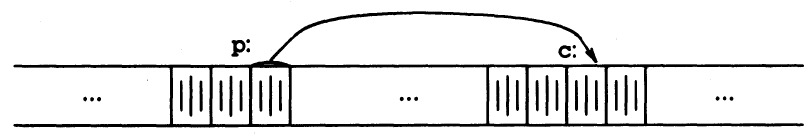

<h1> Concise Guide to the C Programming Language</h1>

Taken from:

- _The C Programming Language, 2nd Edition_
- _C Primer Plus, 5th Edition_
- https://devdocs.io/c

Note: _some sentences or portions of sentences here are direct excerpts from the sources above_.

Contents:

<!---toc start-->

* [Conventions Used In This Guide](#conventions-used-in-this-guide)
* [Background: The C Language](#background-the-c-language)
  * [Language Standards And Evolution](#language-standards-and-evolution)
  * [Major Differences In Versions](#major-differences-in-versions)
  * [Hello World](#hello-world)
* [Data Types](#data-types)
  * [Basic Data Types](#basic-data-types)
    * [Integer Types](#integer-types)
      * [Integer Overflow](#integer-overflow)
      * [Portable Types (`inttypes.h`)](#portable-types-inttypesh)
    * [Real Types](#real-types)
    * [Character Types](#character-types)
    * [Character Strings](#character-strings)
      * [Strings: Arrays Versus Pointers](#strings-arrays-versus-pointers)
    * [Booleans](#booleans)
      * [`_Bool` and `bool`](#_bool-and-bool)
    * [Void Type](#void-type)
  * [Derived Types](#derived-types)
    * [Pointers, Addresses, And Arrays](#pointers-addresses-and-arrays)
    * [Arrays](#arrays)
      * [Pointers And Arrays](#pointers-and-arrays)
      * [Using `const` With Array Parameters](#using-const-with-array-parameters)
      * [Multidimensional Arrays](#multidimensional-arrays)
      * [Designated Initializers](#designated-initializers)
      * [The Null Pointer](#the-null-pointer)
      * [Pointers To Functions](#pointers-to-functions)
      * [Dereferencing An Uninitialized Pointer](#dereferencing-an-uninitialized-pointer)
      * [Advanced Pointer Notation](#advanced-pointer-notation)
    * [Enums](#enums)
    * [Structures (`struct`)](#structures-struct)
      * [Operators Used With Structures](#operators-used-with-structures)
      * [Self-Referential Structures](#self-referential-structures)
  * [Unions](#unions)
  * [Type-Casting (Cast Operator)](#type-casting-cast-operator)
  * [Typedefs](#typedefs)
  * [Implicit Type Conversion](#implicit-type-conversion)
    * [Float Truncation](#float-truncation)
      * [Integer division](#integer-division)
    * [Operations With Real & Int Types](#operations-with-real--int-types)
* [Operators](#operators)
  * [Operator Listing](#operator-listing)
  * [Operator Precedence](#operator-precedence)
  * [Conditional Operator](#conditional-operator)
* [Writing a Program](#writing-a-program)
  * [Variables](#variables)
    * [Declaration, Definition, Initialization, Assignment](#declaration-definition-initialization-assignment)
    * [Specifiers and Classifiers](#specifiers-and-classifiers)
  * [Functions](#functions)
    * [Calling Arguments By Value](#calling-arguments-by-value)
    * [Function Declarations (ANSI Prototypes)](#function-declarations-ansi-prototypes)
    * [Using the `inline` Keyword](#using-the-inline-keyword)
    * [More About `main()`](#more-about-main)
    * [`argc` and `argv` (Command-Line Arguments)](#argc-and-argv-command-line-arguments)
  * [Control Flow](#control-flow)
    * [Loop Structures](#loop-structures)
      * [`while`](#while)
      * [`for`](#for)
      * [`do while`](#do-while)
    * [Using The Comma Operator For Multiple Expressions](#using-the-comma-operator-for-multiple-expressions)
    * [Other Structures](#other-structures)
      * [`if`/`else`/`else-if`](#ifelseelse-if)
      * [`switch`/`case`](#switchcase)
      * [Why `break` Is Needed](#why-break-is-needed)
    * [`goto`](#goto)
  * [Statements, Expressions, and Blocks](#statements-expressions-and-blocks)
  * [Scope](#scope)
    * [External Variables](#external-variables)
    * [Using `static`](#using-static)
* [Preprocessor Directives and Header Files](#preprocessor-directives-and-header-files)
  * [Macros](#macros)
    * [Predefined Macros](#predefined-macros)
    * [Macro Pitfalls](#macro-pitfalls)
  * [The `#include` Directive And Header Files](#the-include-directive-and-header-files)
    * [`"myfile.h"` versus `<myfile.h>`](#myfileh-versus-myfileh)
    * [Header Search Path](#header-search-path)
    * [Redefinition](#redefinition)
  * [The `#define` Guard (Conditional Inclusion/Include Guard)](#the-define-guard-conditional-inclusioninclude-guard)
  * [Computed Includes](#computed-includes)
* [The C Standard Library](#the-c-standard-library)
  * [Functions that Convert to Another Type](#functions-that-convert-to-another-type)
  * [Strings](#strings)
  * [File I/O](#file-io)
  * [Memory Management](#memory-management)
    * [Allocated Memory: `malloc()` and `free()`](#allocated-memory-malloc-and-free)
  * [Error Handling: `stderr` and `exit()`](#error-handling-stderr-and-exit)
  * [The Unix System Interface](#the-unix-system-interface)
* [Translation](#translation)
  * [Compiling & Linking](#compiling--linking)
    * [What a Compiler Does](#what-a-compiler-does)
    * [What a Linker Does](#what-a-linker-does)
    * [C Compilers](#c-compilers)
    * [How To Compile](#how-to-compile)
    * [Compiling Multiple Source Files Into a Program](#compiling-multiple-source-files-into-a-program)
* [Odds & Ends](#odds--ends)
  * [A Word On C++](#a-word-on-c)
  * [C Style & Style Guides](#c-style--style-guides)
  * [Format Specifiers](#format-specifiers)
  * [Keywords](#keywords)
  * [Miscellaneous](#miscellaneous)

<!---toc end-->

## Conventions Used In This Guide

Information about the laptop and OS on which this guide was made and tested:

- Mac OSX High Sierra
- Darwin-18.7.0-x86_64-i386-64bit
- Apple LLVM version 10.0.1 (clang-1001.0.46.4).

This guide:

- Uses `clang` because that's what everything else (`gcc`, `cc`) symlinks to on a Mac.
- Adheres to the C99 standard.
- Uses terse examples, _not_ full programs.

## Background: The C Language

The origin of C is as the language of the UNIX operating system.  Both the system and most of the programs that run on it are written in C.

C is a low-level language.  This characterization is not pejorative; it simply means that C deals with the same sort of objects that most computers do---namely characters, numbers, and addresses.

### Language Standards And Evolution

**1978**: _The C Programming Language_ by Brian Kernighan and Dennis Ritchie is published.  The book is referred to as _K&R_.  The version of C that it describes is commonly referred to as _K&R C_.  For a time, the "C Reference Manual" section in that book was the informal, de facto guide to C implementations, sometimes called **K&R C**.  While K&R defined the C language, it did not specify anything about the C standard library.

**1988**: _The C Programming Language, 2nd edition_ is published.  The **ANSI C** standard, started in 1983, had been completed by this time, but not formally adopted yet.

**1989**: The American National Standards Institute (ANSI) formally adopts a new standard, **ANSI C**.  It defines both the C language and a standard C library.  Also referred to as **C89** or **C90**.

**1999**: **C99** is adopted, which is an extension of C90.  It has since been replaced by **C11** (2011) and **C18** (2018).

For more, see the [history](https://en.wikipedia.org/wiki/C_(programming_language)#History) section on Wikipedia.

### Major Differences In Versions

C89 versus C99:

- C99 requires `int main(void)`, not `main()` or `void main()` as are allowed in C89.
- C99 adds C++/Java-style comments, `// this is a comment`.
- Traditionally, variables with block scope had to be declared at the beginning of a block. C99 has relaxed that rule, allowing you to declare variables anywhere in a block.  In C99, you can do: `for (int i = 0; i < 10; i++)`.

TODO: more differences

### Hello World

Type out the file `hello.c` in your current directory:

```c
/* hello.c */
#include <stdio.h>

int main(void)
{
    printf("hello, world\n");
    return 0;
}
```

Now compile it, and run the resulting executable:

```bash
$ clang -o hello -Wall -Werror -Wextra hello.c
$ ./hello
hello, world
```

## Data Types

### Basic Data Types

#### Integer Types

There are, fundamentally, _eight_ unique integer types as given by their full (verbose) names:

- `signed short int`
- `unsigned short int`
- `signed int`
- `unsigned int`
- `signed long int`
- `unsigned long int`
- `signed long long int`
- `unsigned long long int`

That's it.  All other `int` declarations are merely synonyms for these.

In practice, the `signed` isn't used, since it's the default.  (Use it sparingly if you want to make your intent explicit)  The names used are given in the "Same As" column below.  E.g., `short`, `short int`, `signed short`, and `signed short int` are all ways to express `short int`.

Note: these may be particular to your system.  They are from `/usr/include/i386/limits.h`.

| Full Name                | Same As                     | Min Value              | Max Value                | Format Specifier |
| ------------------------ | --------------------------- | ---------------------- | ------------------------ | ---------------- |
| `short`                  | `short int`                 | -32768                 | 32767                    | `%hd` |
| `short int`              | `short int`                 | -32768                 | 32767                    | `%hd` |
| `signed short`           | `short int`                 | -32768                 | 32767                    | `%hd` |
| `signed short int`       | `short int`                 | -32768                 | 32767                    | `%hd` |
| `unsigned short`         | `unsigned short int`        | 0                      | 65535                    | `%hu` |
| `unsigned short int`     | `unsigned short int`        | 0                      | 65535                    | `%hu` |
| `int`                    | `int`                       | -2147483648            | 2147483647               | `%d` |
| `signed`                 | `int`                       | -2147483648            | 2147483647               | `%d` |
| `signed int`             | `int`                       | -2147483648            | 2147483647               | `%d` |
| `unsigned`               | `unsigned int`              | 0                      | 4294967295               | `%u` |
| `unsigned int`           | `unsigned int`              | 0                      | 4294967295               | `%u` |
| `long`                   | `long int`                  | -9223372036854775808   | 9223372036854775807      | `%ld` |
| `long int`               | `long int`                  | -9223372036854775808   | 9223372036854775807      | `%ld` |
| `signed lont`            | `long int`                  | -9223372036854775808   | 9223372036854775807      | `%ld` |
| `signed long int`        | `long int`                  | -9223372036854775808   | 9223372036854775807      | `%ld` |
| `unsigned long`          | `unsigned long int`         | 0                      | 18446744073709551615     | `%lu` |
| `unsigned long int`      | `unsigned long int`         | 0                      | 18446744073709551615     | `%lu` |

C 99:

| Full Name                | Same As                     | Min Value              | Max Value                | Format Specifier |
| ------------------------ | --------------------------- | ---------------------- | ------------------------ | ---------------- |
| `long long`              | `long long int`             | -9223372036854775808   | 9223372036854775807      | `%lld` |
| `long long int`          | `long long int`             | -9223372036854775808   | 9223372036854775807      | `%lld` |
| `signed long long`       | `long long int`             | -9223372036854775808   | 9223372036854775807      | `%lld` |
| `signed long long int`   | `long long int`             | -9223372036854775808   | 9223372036854775807      | `%lld` |
| `unsigned long long`     | `unsigned long long int`    | 0                      | 18446744073709551615     | `%llu` |
| `unsigned long long int` | `unsigned long long int`    | 0                      | 18446744073709551615     | `%llu` |

Long types "may" use more storage than int, and short types "may" use less storage?  Why "may"? Because C guarantees only that short is no longer than int and that long is no shorter than int, with the goal of fitting the types to the particular machine.

> Besides the minimal bit counts, the C Standard guarantees that `1 == sizeof(char) <= sizeof(short) <= sizeof(int) <= sizeof(long) <= sizeof(long long)`.

##### Integer Overflow

**Integer overflow** occurs when an integer attempts to "get too big" or too small for its type limits.  What happens when ints overflow?

- Unsigned types: "rolls over" to 0 when exceeds max.
- Signed types: the standard doesn't define how signed types should behave.

##### Portable Types (`inttypes.h`)

Knowing that a variable is an `int` doesn't tell you how many bits it is unless you check the documentation for your system.
To get around this problem, C99 provides an alternative set of names that describes exactly what you get, found in `inttypes.h`, or `stdint.h`,
which uses `typedef` to make aliases.

Values (Mac OS X):

```c
typedef     signed char             int8_t;
typedef     short                   int16_t;
typedef     int                     int32_t;
typedef     long long               int64_t;

typedef     unsigned char           uint8_t;
typedef     unsigned short          uint16_t;
typedef     unsigned int            uint32_t;
typedef     unsigned long long      uint64_t;
```

There are a number of subsets of types designed to address certain issues:

- **Minimum width types**: guarantee a type that is at least a certain number of bits in size.
- **Fastest minimum width types**: fastest type for representing at least a certain number of bits.

Values:

```c
/* 7.18.1.2 Minimum-width integer types */
typedef int8_t           int_least8_t;    // At least 8 bits signed
typedef int16_t         int_least16_t;    // At least 16 bits signed
typedef int32_t         int_least32_t;    // At least 32 bits signed
typedef int64_t         int_least64_t;    // At least 64 bits signed
typedef uint8_t         uint_least8_t;    // At least 8 bits unsigned
typedef uint16_t       uint_least16_t;    // At least 16 bits unsigned
typedef uint32_t       uint_least32_t;    // At least 32 bits unsigned
typedef uint64_t       uint_least64_t;    // At least 64 bits unsigned

/* 7.18.1.3 Fastest-width integer types */
typedef int8_t            int_fast8_t;
typedef int16_t          int_fast16_t;
typedef int32_t          int_fast32_t;
typedef int64_t          int_fast64_t;
typedef uint8_t          uint_fast8_t;
typedef uint16_t        uint_fast16_t;
typedef uint32_t        uint_fast32_t;
typedef uint64_t        uint_fast64_t;
```

There is one last typedef that deserves mention, which is `size_t`.  (The return type of `sizeof` and other functions.)  It is typically an `unsigned long` typedef.

#### Real Types

C real (decimal) types are broken up into their sign, exponent, and **mantissa** (non-exponent part).

Floating-point numbers are fundamentally different from integers on a computer. They are stored and processed differently.

| Type          | Precision | Description                                                                         | Format Specifier       |
| ------------- | --------- | ----------------------------------------------------------------------------------- | ---------------------- |
| `float`       | Single    | 32 bit floating point type: sign bit, 8 bits exponent, 23 bits mantissa             |       `%f` or `%e`     |
| `double`      | Double    | 64 bit floating point type: sign bit, 11 bits exponent, 52 bits mantissa            |       `%f` or `%e`     |
| `long double` | Extended  | Varies; some x86 and x86_64 implementations use the 80-bit x87 floating point type. |       `%Lf`/`%Le`      |

You can declare and assign them using a range of syntaxes:

```c
const float hundred = 100.;  // trailing dot
const double pi = 3.14159;
long double planck = 6.63e-34;
```

By default, the compiler assumes floating-point literal constants are `double` precision.

```c
float q;
q = 4.0 * 2.0;  // 4.0 and 2.0 are double.  Use f or F suffix to override
```

#### Character Types

The `char` keyword designates the type used for letters of the alphabet and for other characters, such as `#`, `$`, `%`, and `*`.
The `char` type also can be used to represent small integers, since a `char` internally is just an `int`.
Think of `char` as a typographic symbol.

It follows that a **character constant** is a single character contained between single quotes:

```c
char grade = 'A';  // or: char grade = 65
char beep = 7;  // ASCII bell/alert; char is just an int internally
```

While the language-agnostic definition of a byte is 8 bits, the C language defines a byte to be the number of bits used by type `char`.
This can be found in `limits.h`:

```c
#define    CHAR_BIT    8        /* number of bits in a char */
```

So, more precisely, a `char` is a _single byte_.

Character types:

| Type            | Min Value  | Max Value |
| --------------- | ---------- | --------- |
| `signed char`   |  -128      | 127       |
| `unsigned char` |  0         | 255       |
| `char`          |  -128      | 127       |

`char` is equivalent to either `signed char` or `unsigned char` (which one is implementation-defined and may be controlled by a compiler command-line switch), but `char` is a distinct type, different from both `signed char` both `unsigned char`.

Text stream:  a sequence of characters divided into lines; each line consists of zero or more characters followed by a newline character.

> Types char, and int of all sizes, each with or without sign, and also enumeration types, will collectively be called integral types. The types float, double, and long double will be called floating types.

#### Character Strings

A character constant differs from a **character string** (**string constant**): a sequence of characters in double quotes.
C has no special variable type for strings; use an array of type `char`.

```c
char blob[1024] = "hello world";
```

Therefore, these two variables are not by any means the same:

```c
char c = '\n'    // Character constant
char s[] = "\n"  // String constant that happens to contain only 1 character
```

The difference deserves reiterating:

```c
char done;
done = 'w'  // Character constant; treated by C as an int
done = "W"  // NO; This will not compile
```

C character strings are null-terminated: the final array element is `0x00` or `\0`, the null byte.  Each element of `blob` above is of type `char`.

Note that these two initializations are equivalent:

```c
char pattern1[] = "ould";  // shorthand
char pattern2[] = {'o', 'u', 'l', 'd', '\0'};
```

In this case, the array size is five (four characters plus the terminating `'\0'`).

A note on some related functions:

- `strlen()` is the length of the string excluding the null character.  This is *not* dependent upon the number of elements set aside in the declaration.
- `sizeof(s)`, where `s` is a `char` array, will include the null byte.
- _You must account for the null byte_ when allocating space for a string, `char []`

Example:

```c
// Illustration of character constant v. character string

#include <stdio.h>
#include <string.h>

int main(void)
{
    char a = 'a';
    char b[2];
    strcpy(b, "b");
    printf("%c (%d)\n", a, a);  // %c: character
    printf("%s\n", b);

    printf("strlen(b) %lu; sizeof(b) %lu\n", strlen(b), sizeof(b));
    return 0;
}
```

There are a number of ways of printing multiline strings:

```c
#include <stdio.h>

int main(void)
{
    printf("Here's one way to print a");
    printf(" long string.\n\n");

    printf("Here's another way to print a \
long string.\n\n");

    // Don't do this
    printf("Here's that way again, but notice \
           what happens if we indent.\n\n");

    // ANSI C
    printf("Here's a final way to print a"
           " long string.\n\n");
}
```

##### Strings: Arrays Versus Pointers

Consider these two initializations:

```c
char a_msg[] = "now is the time";  // An array of char
char *p_msg = "now is the time";   // A pointer to a character array
```

The difference in these arises when they are _passed to functions as arguments_.

With the pointer `p_msg`, the result is undefined if you try to modify the string contents.  Remember, functions receive a pointer to the beginning of the character array.  If you pass `p_msg`, you are not modifying the actual string contents.

Secondly, it's worth nothing that _both of these are equivalent as parameters in a function definition_:

```c
int strlen(char s[]) { ... }
int strlen(char *s) { ... }  // Prefer this form
```

That's because functions receive a pointer to the beginning of the character array; within the function, this argument is a local variable, and the function is free to believe it's been passed a pointer or an array.s

#### Booleans

A true expression has the value 1, and a false expression has the value 0.

(And in C as in other languages, 0 evaluates to false, while all other numbers evaluate to true.)

A common idiom is to use:

```c
while (myvar) {
    //
    // do something with myvar where it may eventually become false
}
```

As opposed to `while (myvar != 0)`.

##### `_Bool` and `bool`

C99 adds the type `_Bool` type.

C99 also provides for a header file, `stdbool.h`. This header file makes `bool` an alias for `_Bool` and defines `true` and `false` as symbolic constants for the values 1 and 0.

Examples:

```c
// booldemo.c

#include <stdio.h>
#include <stdbool.h>

// Note: there's no standard way to represent a bool as "true" or "false"
// (There's no specific format specifier.)
// Any integral type shorter than `int` is promoted to `int` when passed
// down to prinf()'s variadic arguments.

int main(void)
{
    bool a = (5 == 5);    // alias via stdbool.h
    _Bool b = (5 == 5);   // C99
    int c = (5 == 5);
    printf("a (as int) == %d\n", a);
    printf("b (as int) == %d\n", b);
    printf("c (as int) == %d\n", c);

    printf("c (as bool) == %s\n", c ? "true" : "false");

    return 0;
}
```

Output:

```bash
$ ./booldemo
a as int == 1
b as int == 1
c as int == 1
c as bool (str) == true
```

#### Void Type

Void is used for declaration of an "incomplete type," to indicate functions that either return no value or take no arguments.

```c
void func(void);
int (*foo(const void *p))[3]; // return type is pointer to array of 3 int
```

### Derived Types

#### Pointers, Addresses, And Arrays

From _C Primer Plus_:

> When you write a program, you think of a variable as having two attributes: a name and a value. ... After the program has been compiled and loaded, the computer also thinks of the same variable as having two attributes: an address and a value. An address is the computer's version of a name.

**Pointer**: a variable whose value is a memory address of a variable.  Just as an int variable has an integer as a value, a pointer variable has an address as a value.

The unary operator `&` gives the address of an object.  You **assign a pointer** using `&`:

```c
// Create a pointer `p` that refers to the object or function `c`
// Assigns the address of `c` to the variable `p`
p = &c
```



Note that this is the memory object of the _variable_, not its value.  (You can show this by printing the address for variables that aren't assigned to anything yet.  They still are allocated space in memory.)

```c
const int z = 10;
int *ptr;                    // Pointer declaration
ptr = &z;                    // Assigns z's address to ptr
printf("ptr: %p", ptr);      // 0x7ffdad200aac (hex) - will vary
```

Above,

- `ptr` "points to" `z`
- `ptr = &z` assigns the address of `z` to the variable `ptr`

The statement `int *ptr` is a **pointer declaration**.  Read this the same as you would any other variable declaration such as `int x`.  It simply says "the expression `*ptr` is an `int`."  It can also be read "`ptr` is a pointer to `int`."

> **Note 1**: C doesn't care whether you declare as `int* ip`, `int*ip`, `int *ip`, though the third is the most common convention.
>
> **Note 2**: The `&` operator only applies to objects in memory: variables and array elements.  It cannot be applied to expressions, constants, or register variables.

The unary operator `*` is the **indirection** or **dereferencing operator**; _when applied to a pointer_, it accesses the object the pointer points to.  Note that there is a distinction between using `*` in a declaration (`int *ip`, as above) and in an assignment (`y = *ip`).

```c
int x = 1, y = 2, z[10];
int *ip;

ip = &x;        // ip now points to x
y = *ip;        // y is now 1 (it accesses x, which `ip` points to)

*ip = 0;        // x is now 0, because we are changing the variable pointed to by ip
ip = &z[0]      // reassignment; ip now points to z[O], an int
```

This is all worth reiterating one more time:

- The _value_ (`*ip`) of what `ip` points to is of type `int`.
- `ip` itself is of type "pointer to int," and the value of `ip` itself is a memory address, internally an unsigned int in most implementations

In other words, the round-trip

```c
ptr = &x;
val = *ptr;  // get the value stored at this address
```

is virtually equivalent to just:

```c
val = x  // get the value from the name
```

Here is a fuller demonstration:

```c
// pointerdemo.c
#include <stdio.h>

int myfunc(int x) { return x; }

int main (void)
{

    int  var = 20;   // actual variable initialization
    int  *ip;        // pointer variable declaration
    ip = &var;       // store address of `var` in pointer variable

    printf("Address of var variable: %p\n", &var);
    // address stored in pointer variable
    printf("Address stored in ip variable: %p\n", ip);
    // access the value using the pointer
    printf("Value of *ip variable: %d\n", *ip);

    // Addr is *not* dependent on value
    int x, y, z;
    x = y = 10;
    z = 10;

    printf("%d, %p\n", x, &x);
    printf("%d, %p\n", y, &y);
    printf("%d, %p\n", z, &z);

    int r = myfunc(x);
    printf("%d, %p\n", r, &r);

   return 0;
}
```

Output:

```bash
$ ../bin/pointerdemo
Address of var variable: 0x7ffeeb7418a8
Address stored in ip variable: 0x7ffeeb7418a8
Value of *ip variable: 20
10, 0x7ffeeb74189c
10, 0x7ffeeb741898
10, 0x7ffeeb741894
10, 0x7ffeeb741890
```

Now, try changing `int *ip` to just `int ip`.  What happens?  Well, firstly, the C file won't even compile.  That's because you're now trying to declare `ip` as a plain old `int` rather than pointer to an `int`.  Now when you go to say `ip = &var`, you would be _trying to assign the address of `var` to `ip`_, which is supposed to be an `int`.

Take a look again:

```c
int var = 20;
int *ip;
ip = &var;
```

This makes `ip` equal to the address of `var` (_not_ 20).  It is when you dereference it with `*ip` again that it becomes the actual value referenced.

Another place you will see the unary operator is in function definitions, such as:

```c
// atof takes a pointer and returns a pointer to double
double *dp, atof(char *);
```

A good example is in a typical `swap()` function.  Remember that C passes arguments to functions by their value, so this will not work:

```c
void swap(int x, int y)    /* WRONG */
{
    int temp;
    temp = x;
    x = y;
    y = temp;
}
```

This is wrong because `swap(a, b)` will not modify `a` and `b`; it will only modify the temporary local variables.

The way to obtain the desired effect is for the calling program to pass pointers to the values to be changed:

```c
/* swap.c */

// *px is the object that pointer px points to */
void swap(int *px, int *py)
{
    int temp;
    temp = *px;   // `temp` accesses the object that `px` points to
    *px = *py;
    *py = temp;
}
```

You need to transmit memory addresses to `swap()`, so its function prototype should specify pointers, and you would *call* `swap()` with addresses:

```c
swap(&a, &b);
```

```bash
$ ./swap
a: 5
b: 10
swapping...
a: 10
b: 5
```

To review:

- The function parameters say, "`*px` is an `int`".  When `*` is applied to a pointer, it accesses the object that pointer points to.
- You are passing pointers (_the memory address of `a` and `b`_).

This is a pattern that you can use to modify variables in-place.

> When you write a function that processes a fundamental type, such as int, you have a choice of passing the int by value or of passing a pointer-to-int. _The usual rule is to pass quantities by value unless the program needs to alter the value, in which case you pass a pointer._

A great example from the C standard library is `scanf()`: it's signature is `int scanf(const char *format, ...)`, where `format` is a **control format string**.

```c
// scanfdemo.c

#include <stdio.h>

#define length(arr)     sizeof(arr) / sizeof(int)

int main(void)
{
    int x, i, res;

    int arr[3];
    char name[40];

    printf("Hi! What's your first name?\n");
    // No & operator here for arrays.  name is already an address!
    // scanf() returns the number of items that it successfully reads
    res = scanf("%s", name);
    printf("res is now %d\n", res);

    printf("Enter your input for x: ");
    res = scanf("%d", &x);  // Tell scanf where to "place" input
    printf("res is now %d\n", res);

    printf("Enter 3 inputs for arr, separated by whitespace: ");
    for (i = 0; i < length(arr); i++)
    {
        // Read in array elements
        // An element of an int array is handled just like an int
        scanf("%d", &arr[i]);
    }

    printf("arr is:\n");
    for (i = 0; i < length(arr); i++)
    {
        printf("%d ", arr[i]);
    }
    printf("\n");
}
```

Output:

```bash
$ ../bin/scanfdemo
Hi! What's your first name?
Brad
res is now 1
Enter your input for x: 5
res is now 1
Enter 3 inputs for arr, separated by whitespace: 1 2 3
arr is:
1 2 3
```

#### Arrays

**Array**: a series of values of the same type.  Members of an array are consecutively-placed objects in memory.

Declaration:

```c
int arr[50];
char s[1024];
double ndarr[100000];  // allocate space for 100,000 elements
```

Initialization:

```c
int powers[8] = {1, 2, 4, 6, 8, 16, 32, 64};

const int MONTHS = 12;
// *elements* are constants; using variable in size is C99 feature
const int days[MONTHS] = {31,28,31,30,31,30,31,31,30,31,30,31};
```

Note that C does absolutely no bounds-checking, per the C philosophy of trusting the programmer.  Accessing an out-of-bounds element is an undefined behavior and will return some other thing in memory.

##### Pointers And Arrays

Pointers and arrays are closely related; any operation that can be achieved by array subscripting can also be done with pointers.

The usual rule is to pass quantities by value unless the program needs to alter the value, in which case you pass a pointer. _Arrays don't give you that choice; you must pass a pointer._ The reason is efficiency. If a function passed an array by value, it would have to allocate enough space to hold a copy of the original array and then copy all the data from the original array to the new array.

```c
int a[10];
int *pa;        // `pa` is pointer to an int; `*pa` is type int
pa = &a[0]        // assignment: set `pa` to point to element 0 of `a`
                // `pa` contains the address of a[0]
```

The meaning of "adding 1 to a pointer" (and all pointer arithmetic) is that `pa + 1` points to the next object, and `pa + i` points to the i-th object beyond `pa`.

```c
int x, y
x = *pa         // copy the contents of a[0] into x
y = *(pa + 1)    // pa + 1 is the *address* of a[1]
                // *(pa + 1) is the *contents* of a[1]
```

When an array name is passed to a function, what is passed is the location of the initial element.  (`pa = &a[0]` can actually be written as just `pa = a`.)

Within the called function, this argument is a local variable, and so an array name parameter is a pointer, that is, a variable containing an address:

```c
// strlen: return length of string s
int strlen(char *s)
{
    int n;
    // s is a pointer, so we can increment it
    // this has no effect on the argument since strlen
    // gets a local copy of the pointer
    for (n = 0; *s != '\0'; s++)
        n++;
    return n;
}
```

As formal parameters in a function definition, `char s[]` and `char *s` are equivalent.  Prefer the latter because it says more explicitly that the parameter is a pointer.

##### Using `const` With Array Parameters

If a function's intent is that it not change the contents of the array, use the keyword `const` when declaring the formal parameter in the prototype and in the function definition.

```c
int sum(const int ar[], int n); /* function prototype */

int sum(const int ar[], int n) /* definition */
{
    int i;
    int total = 0;
    for( i = 0; i < n; i++)
        total += ar[i];
    return total;
}
```

This tells the compiler that the function should treat the array pointed to by `ar` as though the array contains constant data. Then, if you accidentally use an expression such as `ar[i]++`, the compiler can catch it and generate an error message.

##### Multidimensional Arrays

In the declaration below for 5 years of monthly rainfall data, `rain` is an array with 5 elements; each of those elements is an array of 12 floats:

```c
float rain[5][12]; // array of 5 arrays of 12 floats
```

```c
#define MONTHS 12
#define YEARS 5

const float rain[YEARS][MONTHS] =
{
    {4.3, 4.3, 4.3, 3.0, 2.0, 1.2, 0.2, 0.2, 0.4, 2.4, 3.5, 6.6},
    {8.5, 8.2, 1.2, 1.6, 2.4, 0.0, 5.2, 0.9, 0.3, 0.9, 1.4, 7.3},
    {9.1, 8.5, 6.7, 4.3, 2.1, 0.8, 0.2, 0.2, 1.1, 2.3, 6.1, 8.4},
    {7.2, 9.9, 8.4, 3.3, 1.2, 0.8, 0.4, 0.0, 0.6, 1.7, 4.3, 6.2},
    {7.6, 5.6, 3.8, 2.8, 3.8, 0.2, 0.0, 0.0, 0.0, 1.3, 2.6, 5.2}
};
```

##### Designated Initializers

You may occasionally see this syntax, which was added in C99:

```c
// initialize arr[5] to 212, all other elements to 0
// same as int arr[6] = {0,0,0,0,0,212}
int arr[6] = {[5] = 212};
```

##### The Null Pointer

One other thing needs covered: the "pointer to void", which is used to hold any type of pointer.  The **null pointer** is the designated "generic pointer" in C.  It is a reference to nothing.

> Also, ANSI C uses pointer-to-void as a kind of generic pointer for situations in which pointers to different types may be used.

```c
/* nullpointer.c */
#include <stdio.h>

int main (void)
{
   int *ptr = NULL;  // the null pointer
   printf("The value of ptr is: %x\n", ptr);
   return 0;
}
```

```bash
$ ./nullpointer
The value of ptr is: 0
```

Here's a slightly more advanced (and idiomatic) example:

```c
int n=1, *p=&n;
void* pv = p;             // int* to void*
int* p2 = pv;             // void* to int*
printf("%d\n", *p2);     // prints 1
```

An example is `malloc()`, with the signature `void *malloc(size_t size)`.  It can be used to return pointers to arrays, structures, and so forth, so normally the return value is typecast to the proper value.

##### Pointers To Functions

A pointer to function can be initialized with an address of a function. Because of the function-to-pointer conversion, the address-of operator is optional:

```c
void f(int);
void (*pf1)(int) = &f;
void (*pf2)(int) = f; // same as &f
```

##### Dereferencing An Uninitialized Pointer

Do not dereference an uninitialized pointer:

```c
int * pt;         // declared but  uninitialized pointer
*pt = 5;          // BAD
```

The second line means store the value 5 in the location to which `pt` points. But `pt`, being uninitialized, has a random value, so there is no knowing where the 5 will be placed. It might go somewhere harmless, it might overwrite data or code, or it might cause the program to crash.

##### Advanced Pointer Notation

Consider these (valid) declarations (TODO):

```c
const int *pc = &n;         // initialization; pc is a non-const pointer to a const int
int * const cp = &n;         // cp is a const pointer to a non-const int
int * const * pcp = &cp;     // non-const pointer to const pointer to non-const int

float *p, **pp;         // p is a pointer to float
                        // pp is a pointer to a pointer to float
int (*fp)(int);         // fp is a pointer to function with type int(int)

int a[2];
int (*ap)[2] = &a; // pointer to array of int

struct S { int n; } s = {1}
int* sp = &s.n; // pointer to the int that is a member of s

int n;
int *p = &n;             // pointer p is pointing to n
*p = 7;                 // stores 7 in n
printf("%d\n", *p);     // lvalue-to-rvalue conversion reads the value from n
```

#### Enums

An `enum` (or **enumeration constant**) is a mapping of integers to values:

```c
enum boolean {no, yes};
enum { NAME, PARENS, BRACKETS };
enum {
    KEYWORD = 01, // octal
    EXTERNAL = 010,
    STATIC = 0100
};
```

You access enum constants directly (unlike in Python, where they are attributes):

```c
printf("%d, %d, %d\n", NAME, PARENS, BRACKETS);
```

If not all values are specified, unspecified values continue the progression from the last specified value, as in the second of these examples:

```c
enum escapes {BELL= '\a', BACKSPACE= '\b', TAB= '\t',
              NEWLINE= '\n', VTAB = '\v', RETURN= '\r' };

enum months { JAN = 1, FEB, MAR, APR, MAY, JUN,
              JUL, AUG, SEP, OCT, NOV, DEC };
              /* FEB is 2, MAR is 3, etc. */
```

Note that identifiers declared as enumerators are of type `int`.

#### Structures (`struct`)

A **structure** (**struct**) is a collection of one or more variables, possibly of different types, grouped together under a single name for convenient handling.
(Structures are called "records" in some languages.)

The keyword `struct` introduces a structure declaration:

```c
// Structure declaration
struct point {
    int x;
    int y;
};
```

A `struct` declaration defines a type.  (Above, `point` is now a bona fide type.)  `point` is the **structure tag**.

The variables named in a structure are called **members**.

The right brace that terminates the list of members may be followed by a list of variables, just as for any basic type:

```c
struct key {
    char *word;
    int count;
} keytab[5];  // Defines an array keytab of structures of this type
```

This is not all that different from:

```c
int keytab[5]
```

In other words, these two forms are syntactically analogous:

```c
struct { ... }     x, y, z;
int                x, y, z;
```

The above could also be written:

```c
// Declare a type `key`
struct key {
    char *word;
    int count;
};

struct key keytab[5];
```

A structure can also be initialized like this:

```c
struct mapping {
    char *group;
    int count;
} map[] = {
    "northwest", 5,
    "southeast", 6,
    "southwest", 10
};
```

Putting things together, here is an example of structure declaration, definition, and initialization:

```c
// Structure declaration
struct point {
    int x;
    int y;
};

// Definition
// `pt` is a structure of type `struct point`
struct point pt;

// Initialization
struct point maxpt = { 320, 200 };
```

Structures can use a factory function:

```c
struct point makepoint(int x, int y)
{
    struct point temp;
    temp.x = x;
    temp.y = y;
    return temp;
```

Usage:

```c
struct rect screen;               // a rect struct called screen
struct point middle;
struct point makepoint(int, int);

screen.pt1 = makepoint(0, 0);
screen.pt2 = makepoint(XMAX, YMAX);
middle= makepoint((screen.pt1.x + screen.pt2.x)/2,
                  (screen.pt1.y + screen.pt2.y)/2);
```

```c
struct point addpoint(struct point p1, struct point p2)
{
    // structure parameters are passed by value like any others
    // no need for temporary variable
    p1.x += p2.x;
    p1.y += p2.y;
    return p1;
}
```

This assumes that the rectangle is represented in a standard form where the `pt1` coordinates are less than the `pt2` coordinates.

```c
/* ptinrect: return 1 if p in r, 0 if not */
int ptinrect(struct point p, struct rect r)
{
    return p.x >= r.pt1.x && p.x < r.pt2.x
        && p.y >= r.pt1.y && p.y < r.pt2.y;
}
```

##### Operators Used With Structures

There are two relevant member access operators for structures:

- Member access (`a.b`): access member `b` of `struct` or `union` `a`
- Member access via pointer (`a->b`): access member `b` of `struct` or `union` pointed to by `a`
  - `p->x` is shorthand for `(*pp).x`, where `p` is a pointer to a structure.

The first is straightforward:

```c
printf( "%d,%d", pt.x, pt.y);
```

The second (`a->b`) is more involved.
It is common to use pointers to structures for efficiency rather than copy the entire structure.
Structure pointers are just like pointers to ordinary variables.
The declaration `struct point *pp;` says that `pp` is a pointer to a structure of type `struct point`.

Hence, `p->x` is shorthand for `(*pp).x`, where `p` is a pointer to a structure.

This means that `*p->x` fetches whatever `x` points to.

##### Self-Referential Structures

A structure member may be a pointer to an instance of the same structure.

A common example is a `struct` representing a node in a binary tree (see K&R section 6.5):

```c
struct tnode {
    char twords[20];
    int count;
    struct tnode *left;  // Must be pointer!
    struct tnode *right;
}
```

### Unions

A **union** is a variable that may hold (at different times) objects of different types and sizes, with the compiler keeping track of size and alignment requirements.

Purpose: a single variable that can legitimately hold any one of several types;
the value occupies the same amount of storage and is stored in the same place regardless of its type.

```c
union u_tag {
    int ival;
    float fval;
    char *sval;
} u;
```

Access uses `a.b` or `a->b`, same as for structures.

The variable `u` will be large enough to hold the largest of the three types;
the specific size is implementation-dependent.

### Type-Casting (Cast Operator)

A type-cast (or just cast) is a way to convert a variable from one data type to another data type.

Type-casting uses the type-cast operator: `(type)a` casts the type of `a` to `type`.

```c
/* tcast.c */

#include <stdio.h>

int main(void)
{
    float n = 5.0489;
    printf("%f as int: %d\n", n, (int)n);
    return 0;
}
```

```bash
$ ./tcast
5.048900 as int: 5
```

The parentheses and type name together constitute a cast operator: `(type)` is considered the full operator.

```c
double a;
int b;
a = 1.6 + 1.7;
b = (int) 1.8 + (int) a;  // case 1.8 and a as int (truncate them)
```

### Typedefs

`typedef` **defines a type under a given name.**  It does not declare an object; it just creates an alias for a type.

> Declarations whose storage class specifier is `typedef` do not declare objects; instead they define identifiers that name types.
> These identifiers are called `typedef` names.

Basic examples:

```c
// Makes the name Length a synonym for int
typedef int Length;

// Makes String a synonym for char* (character pointer)
typedef char *String

// Defines a term `BYTE` for one-byte numbers:
typedef unsigned char BYTE;
BYTE  b1, b2;
```

More complicated example: you can `typedef` a structure:

```c
// Create two new aliases, Treenode and Treeptr

typedef struct tnode   *Treeptr;
//      [1st part  ] [2nd part]

typedef struct tnode {
    char *word;
    int count;
    Treeptr left;
    Treeptr right;
} Treenode;

/* ***** */
struct names_st
{
    char first[SLEN];
    char last[SLEN];
};

typedef struct names_st names;
```

See also: https://www.tutorialspoint.com/cprogramming/c_typedef.htm

### Implicit Type Conversion

> When an operator has operands of different types, they are converted to a common type according to a small number of rules.
> In general, the only automatic conversions are those that convert a "narrower" operand into a "wider" one without losing information, such as converting an `int` to `float` point.

If there are no unsigned operands, the following informal set of rules suffices (prioritized):

- If either operand is a `long double`, convert the other to `long double`
- Otherwise, if either operand is `double`, convert the other to `double`
- Otherwise, if either operand is `float`, convert the other to `float`
- Otherwise, convert `char` and `short` to `int`
- Last, if either operand is `long`, convert the other to `long`

#### Float Truncation

When converting floating-point values to integers, C simply throws away the decimal part (truncation) instead of rounding.

This means that, for instance, `const int cost = 12.99` becomes just 12, not 13.

#### Integer division

- Integer division truncates: any fractional part is discarded.  This means that `5 / 4` is 1.

#### Operations With Real & Int Types

If an arithmetic operator has one floating-point operand and one integer operand, the integer will be converted to floating point before the operation is done.

```c
printf("5.0 / 4: %f\n", 5.0 / 4);        // 1.250000
printf("5.0 / 4.0: %f\n", 5.0 / 4.0);    // 1.250000
printf("5 / 4: %d\n", 5 / 4);            // 1 (truncates)
```

#### Conversion from Function Prototypes

If arguments are declared by a function prototype, the declaration causes automatic coercion of any arguments when the function is called.

Thus, given the prototype for `sqrt()`:

```c
double sqrt(double);
```

the call `root2 = sqrt(2);` is valid, because the integer 2 will be coerced to float.

## Operators

### Operator Listing

Note: C has no exponentiation operator such as Python's `**`.  (Although the standard library contains a function `pow(x, y)`.)

| Operator | Operator Name                 | Example       | Description                                                                                                                                                       | Kind          |
|----------|-------------------------------|---------------|-------------------------------------------------------------------------------------------------------------------------------------------------------------------|---------------|
| `(...)`  | function call                 | `f(...)`      | call the function f(), with zero or more arguments                                                                                                                | other         |
| `,`      | comma operator                | `a, b`        | evaluate expression a, disregard its return value and complete any side-effects, then evaluate expression b, returning the type and the result of this evaluation | other         |
| `(type)` | type cast                     | `(type) a`    | cast the type of a to `type`; space is optional like everywhere else                                                                                                                                        | other         |
| `?:`     | conditional operator          | `a ? b : c`   | if a is logically true (does not evaluate to zero) then evaluate expression b, otherwise evaluate expression c                                                    | other         |
| `sizeof` | sizeof operator               | `sizeof a`    | the size in bytes of a.  Calling with parentheses is required for types but optional for variables                                                                                                                                            | other         |
| `[]`     | array subscript               | `a[b]`        | access the bth element of array a                                                                                                                                 | member access |
| `*`      | pointer dereference           | `*a`          | dereference the pointer a to access the object or function it refers to                                                                                           | member access |
| `&`      | address of                    | `&a`          | create a pointer that refers to the object or function a                                                                                                          | member access |
| `.`      | member access                 | `a.b`         | access member b of struct or union a                                                                                                                              | member access |
| `->`     | member access through pointer | `a->b`        | access member b of struct or union pointed to by a                                                                                                                | member access |
| `!`      | logical NOT                   | `if (!valid)` | the logical negation of a                                                                                                                                         | logical operators |
| `&&`     | logical AND                   | `a && b`      | the logical AND of a and b                                                                                                                                        | logical operators |
| `||`     | logical OR                    | `a || b`      | the logical OR of a and b                                                                                                                                         | logical operators |
| `expr ++`| increment (postfix form)      | `aplus = a++` | `aplus` takes on the value of `a` _before_ `a` is incremented\*                                                                                                                                                                  | increment/decrement operators |
| `++ expr`| increment (prefix form)       | `plusa = ++a` | `aplus` takes on the value of `a` _after_ `a` is incremented\*                                                                                                                                                                  | increment/decrement operators |
| `expr --`| decrement (postfix form)      | `a--`         | same as above postfix increment, but for decrement                                                                                                                                                                  | increment/decrement operators |
| `-- expr`| decrement (prefix form)       | `--a`         | same as above prefix increment, but for decrement                                                                                                                                                                  | increment/decrement operators |
| `==`     | equal to                      | `a == b`      | a is equal to b                                                                                                                                                   | comparison operators |
| `!=`     | not equal to                  | `a != b`      | a is not equal to b                                                                                                                                               | comparison operators |
| `<`      | less than                     | `a < b`       | a is less than b                                                                                                                                                  | comparison operators |
| `>`      | greater than                  | `a > b`       | a is greater than b                                                                                                                                               | comparison operators |
| `<=`     | less than or equal to         | `a <= b`      | a is less than or equal to b                                                                                                                                      | comparison operators |
| `>=`     | greater than or equal to      | `a >= b`      | a is greater than or equal to b                                                                                                                                   | comparison operators |
| `=`      | basic assignment              | `a = b`       | a becomes equal to b                                                                                                                                              | assignment operators |
| `+=`     | addition assignment           | `a += b`      | a becomes equal to the addition of a and b                                                                                                                        | assignment operators |
| `-=`     | subtraction assignment        | `a -= b`      | a becomes equal to the subtraction of b from a                                                                                                                    | assignment operators |
| `*=`     | multiplication assignment     | `a *= b`      | a becomes equal to the product of a and b                                                                                                                         | assignment operators |
| `/=`     | division assignment           | `a /= b`      | a becomes equal to the division of a by b                                                                                                                         | assignment operators |
| `%=`     | modulo assignment             | `a %= b`      | a becomes equal to the remainder of a divided by b                                                                                                                | assignment operators |
| `&=`     | bitwise AND assignment        | `a &= b`      | a becomes equal to the bitwise AND of a and b                                                                                                                     | assignment operators |
| `|=`     | bitwise OR assignment         | `a |= b`      | a becomes equal to the bitwise OR of a and b                                                                                                                      | assignment operators |
| `^=`     | bitwise XOR assignment        | `a ^= b`      | a becomes equal to the bitwise XOR of a and b                                                                                                                     | assignment operators |
| `<<=`    | bitwise left shift assignment | `a <<= b`     | a becomes equal to a left shifted by b                                                                                                                            | assignment operators |
| `>>=`    | bitwise right shift assignment| `a >>= b`     | a becomes equal to a right shifted by b                                                                                                                           | assignment operators |

\* As another example:

```c
float shoe = 2.0;

while (++shoe < 18.5)        // Prefix, goes to size 18
{
    // ...
}

float shoe = 2.0;

while (shoe++ < 18.5)            // Postfix, goes to size 19
{
    // ...
}
```

In the first example (prefix), `shoe` is increased before the comparison.

In the second example (postfix), `shoe` is increased after the comparison.

### Operator Precedence

See also: [Operator precedence](https://devdocs.io/c/language/operator_precedence)

### Conditional Operator

The conditional operator, `?:`, is a shorthand if-else statement.  It is a type of **ternary operatoor**.  A ternary (versus binary or unary operator) is a two-part operator with three operators.

Form: `expression1 ? expression2 : expression3`.

Meaning/translation:

```c
if (expression1)
    expression2;
else
    expression3;
```

These may result in more compact program code.

## Writing a Program

### Variables

#### Declaration, Definition, Initialization, Assignment

A **declaration** specifies a type and contains a list of one or more variables of that type.
In C, all variables must be declared before they can be used.
The variable is given its null value:

```c
/* Declarations */
int lower, upper;
int step;
char line[1000];
```

An **assignment** assigns a value to a variable.

```c
/* Assignments */
lower = 10;
upper = 50;
```

An **initialization** is the combination of a declaration and assignment:

```c
/* Initialization */
char    esc = '\\';
int     i = 0;
int     limit = MAXLINE + 1;   // reference an identifier
float   eps = 1.0e-5;
```

Review:

```c
int x;        // Declaration statement
x = 2;        // Assignment statement
int y = 4;    // Initialization statement
```

The trickiest difference is the [distinction between declaration and **definition**](https://stackoverflow.com/a/1410632/7954504):

There are some very clear definitions sprinkled throughout K&R (2nd edition); it helps to put them in one place and read them as one:

> "Definition" refers to the place where the variable is created or assigned storage; "declaration" refers to the places where the nature of the variable is stated but no storage is allocated. [p. 33]
>
> ...
>
> It is important to distinguish between the _declaration_ of an external variable and its _definition_.  A declaration announces the properties of a variable (primarily its type); a definition also causes storage to be set aside.
>  If the lines
>
>     int sp;
>     double val[MAXVAL]
>
> appear outside of any function, they _define_ the external variables `sp` and `val`, cause storage to be set aside, and also serve as the declaration for the rest of that source file.
>
> On the other hand, the lines
>
>     extern int sp;
>     extern double val[];
>
> _declare_ for the rest of the source file that `sp` is an `int` and that `val` is a `double` array (whose size is determined elsewhere), but they do not create the variables or reserve storage for them.
>
> There must be only one _definition_ of an external variable among all the files that make up the source program. ... Array sizes must be specified with the definition, but are optional with an `extern` declaration. [pp. 80-81]
>
> ...
>
> Declarations specify the interpretation given to each identifier; they do not necessarily reserve storage associated with the identifier.  Declarations that reserve storage are called _definitions_.   [p. 210]

See also: https://stackoverflow.com/a/1410632/7954504

#### Specifiers and Classifiers

This section covers `extern`, `register`, `static` (specifiers) as well as `const` and `volatile` (classifiers).

`extern`:

- Explicitly makes a variable have external scope
- Constitutes a declaration, not a definition (does not create or reserve storage)

`register`:

- Advises compiler that variable will be heavily used
- A declaration
- Compilers are free to ignore it
- Can only be applied to automatic variables and function parameters

`static`:

- Limits scope
- With external variables or functions: limits scope to their file
- Within functions: variable remains in existence after calls

Examples:

```c
// file scope, external linkage;
// can be used by other files that are part of the same program
int giants = 5;

// file scope, internal linkage;
// private to this particular file, but can be used by any function in the file
static int dodgers = 3;
```

`const`:

- Specifies that the value will not be changed
- For arrays: means that elements won't be changed
- May be initialized, but not thereafter assigned to or reassigned
- Used to place objects in read-only memory (efficiency gain)
- Qualifiers and specifiers may be combined; `static const` is also valid

Examples:

```c
const double    e = 2.71828182845905; // e is now read-only
const char      msq[] = "warning: ";  // elements will not be altered

// Used with array parameters, indicates that function does not alter the array
int strlen(const char[]);
```

Note that the following is illegal; you should do the initialization in one line:

```c
const int nochange;    // qualifies m as being constant
nochange = 12;         // not allowed
```

`volatile`:

- Announces that object has special properties relative to optimization
- Tells compiler to suppress optimizations that would otherwise occur
- Typically used for hardware addresses and for data shared with other programs running simultaneously

> **Note**: `typedef` is also technically a storage class specifier, but is covered elsewhere in this guide.

### Functions

C's design philosophy is to use functions as building blocks.

C has no exponentiation operator such as Python's `**`.  Let's build our own.

```c
/* power.c */

#include <stdio.h>

/* As of C99, you need to explicitly declare functions
   before they're called, besides main().
   Declare it now because we call it in main().

   This is called a function prototype. */
int power(int m, int n);

int main(void)
{
    int i;
    printf("%6s %6s %6s\n", "i", "2^i", "-3^i");
    printf("     ---------------\n");
    for (i = 0; i < 10; ++i)
        printf("%6d %6d %6d\n", i, power(2, i), power(-3, i));
    return 0;
}

/* power: raise base to n-th power; n >= 0 */
int power(int base, int n)
{
    int i, p;
    p = 1;
    for (i = 1; i <= n; ++i)
        p = p * base;
    return p;
}
```

Output:

```bash
$ ./power
     i    2^i   -3^i
     ---------------
     0      1      1
     1      2     -3
     2      4      9
     3      8    -27
     4     16     81
     5     32   -243
     6     64    729
     7    128  -2187
     8    256   6561
     9    512 -19683
```

Note: In C, functions may not be defined within other functions.

```c
/* atoiext.c */
#include <ctype.h>

/* atof: convert string s to double */
double atof(char s[])
{
    double val, power
    int i, sign

    for (i = 0; isspace(s[i]); i++)
        sign = (s[i] == '-' ? -1 : 1);
        if (s[i] == '+' || s[i] == '-')
            i++;
        for (val= 0.0; isdigit(s[i]); i++)
            val = 10.0 * val + (s[i] - '0');
        if (s[i] == '.')
            i++;
        for (power= 1.0; isdigit(s[i]); i++) {
            val = 10.0 * val+ (s[i] - '0');
            power *= 10.0;
        }
        return sign * val / power;
}
```

#### Calling Arguments By Value

TODO: condense this section.

> **Note**: **Parameter** refers to a variable named in the parenthesized list in a function definition, while **argument** refers to the value used in a call of the function.

In C, all function arguments are passed "by value."
This means that the called function is given the values of its arguments in temporary variables rather than the originals.
This leads to some different properties than are seen with "call by reference" languages.

The main distinction is that in C the called function cannot directly alter a variable in the calling function; it can only alter its private, temporary copy.

That means that `power.c`, from above, can be written like:

```c
int power(int base, int n)
{
    int p;
    for (p = 1; n > 0; --n)
        p = p * base;
    return p;
}
```

Notice that:

- The parameter `n` is used as a temporary variable, and is decremented until it becomes zero; there is no longer a need for the variable `i`.
- Whatever is done to `n` inside `power()` has no effect on the argument that power was called with originally.

There are exceptions to the above:

1. To modify an argument within a function call, the caller must provide the address of the variable to be set (technically a **pointer** to the variable), and the called function must declare the parameter to be a pointer and access the variable indirectly through it.
1. The `array` type doesn't follow this rule: when the name of an array is used as an argument, the value passed to the function is the location or address of the beginning of the array-there is no copying of array elements. By subscripting this value, the function can access and alter any element of the array.

#### Function Declarations (ANSI Prototypes)

An up-front declaration of a function's signature is called an **ANSI prototype**, **ANSI function prototype**, or just **function prototype**.
It informs the compiler about functions that will be used: their signatures and return types.

Reasons for, and effects of, function prototyping:

- Compiler will insert a type cast, if needed, to convert the actual argument to the type specified by the prototype.
- They enforce that you call functions according to their signatures.

Note that ANSI C form requires that each variable be preceded by its type within a function declaration or definition.
That is, unlike the case with regular declarations, you can't use a list of variables of the same type:

```c
void dibs(int x, y, z)            // NO: invalid function header
void dubs(int x, int y, int z)    // valid function header
```

Parameter names are optional in a function prototype:

```c
int power(int, int);   // OK; parameter names not required
```

An alternative to using function prototypes is to completely define the function in the code before it is first called.  This is okay for smaller functions:

```c
#include <stdio.h>
#include <math.h>

int f(a, b) { return a * a + (b % a); }  // *Definition*, not prototype

int main(void)
{
    // ...
}
```

#### Using the `inline` Keyword

From _C Primer Plus_:

> Normally, a function call has overhead. That means it takes execution time to set up the call, pass arguments, jump to the function code, and return. Reducing that time is one of the justifications for using function-like macros. C99 has an alternative, `inline` functions. The C99 standard has this to say: "Making a function an `inline` function suggests that calls to the function be as fast as possible. The extent to which such suggestions are effective is implementation-defined."

Usage:

```c
inline void eatline(void)  // serves as definition + prototype
{
    while (getchar() != '\n')
        continue;
}

int main()
{
    // ...
    eatline(); // function call
    // ...
}
```

From the [Linux kernel coding style](https://github.com/torvalds/linux/blob/master/Documentation/process/coding-style.rst):

> A reasonable rule of thumb is to not put `inline` at functions that have more than 3 lines of code in them.

#### More About `main()`

Normally you are at liberty to give functions whatever names you like, but "main" is special: your program begins executing at the beginning of `main()`. This means that every program must have a `main()` some where.

A C program always begins execution with the function called `main()`.  It is best practice to put `main()` at the top of the C source file.

Always define `main()` with this exact signature:

```c
int main(void) { ... }
```

You may see just `main()` or `void main()` used; this is tolerated by C90, but not by C99.

A little detail on the return value:

> You may have noticed that there is a return statement at the end of `main()`. Since `main()` is a function like any other, it may return a value to its caller, which is in effect the environment in which the program was executed. Typically, a return value of zero implies normal termination; non-zero values signal unusual or erroneous termination conditions. In the interests of simplicity, we have omitted return statements from our main functions up to this point, but we will include them hereafter, as a reminder that programs should return status to their environment.

#### `argc` and `argv` (Command-Line Arguments)

When a script's `main()` is invoked, it is always implicitly called with two arguments, `argc` and `argv`:

- `argc` (argument count): the number of command line arguments the program was invoked with.
  - Will always be at least 1, since it includes the program name itself.
- `argv` (argument vector): a pointer to an array of character strings that contain the arguments, one per string.
  - It is technically a pointer to an array of pointers.
  - By convention, `argv[0]` is the name with which the program was invoked, so `argc` is at least 1.
  - `argv[argc]` is a null pointer.

### Control Flow

#### Loop Structures

C has 3 loop structures:

1. `while`
1. `for`
1. `do while`

Both `while` and `for` follow the form:

```c
kwd (condition)
    body
```

The `body` can be either:

1. One or more statements enclosed in braces
1. _A single statement without braces_

##### `while`

Syntax:

```
while (expression)
    body
```

The `body` part can be a simple statement with a terminating semicolon, or it can be a compound statement enclosed in braces:

```c
// simple statement with a terminating semicolon
while (i < j)
    i = 2 * i;

// compound statement enclosed in braces
while (fahr <= upper) {
    celsius = 5 * (fahr-32) / 9;
    fahr += step;
}
```

##### `for`

Components:

```c
for (initialization; condition; increment)
    body
```

Variations:

```c
for (ch = 'a'; ch <= 'z'; ch++)                // Count by characters (which are just ints)
for (i = 0; i < 10; i = i + 2)                 // Count by something other than 1
for (i = 10; i > 0; i--)                       // Decrement
for (n = 3; ans <= 25; )                       // Leave one or more expressions blank (null expression)
for (n = 100; ; n = n + 100)                   // Empty middle expression evaluates to true
for (;;)                                       // Infinite loop with no initialization, like while (1)
for (i = 10; i * i < 25; i++)                  // Different test condition
for (x = 1; y <= 75; y = (++x * 5) + 50);      // Any legal expression for third expression
for (n = 1; n < 10000; n = n + delta)          // Parameters (delta) altered within loop block body

// Multiple expressions with comma operator
for (ounces=1, cost=FIRST_OZ; ounces <= 16; ounces++, cost += NEXT_OZ)
```

Similar to `while`, `body` part can be a simple statement with a terminating semicolon, or it can be a compound statement enclosed in braces:

```c
// simple statement with a terminating semicolon
for (i = 1; i <= n; ++i)
    p = p * base;

// compound statement enclosed in braces
for (j=i-gap; j>=0 && v[j]<v[j+gap]; j-=gap) {
    temp = v[j];
    v[j] = v[j+gap];
    v[j+gap] = temp;
}
```

The grammatical rules of C require that a `for` statement have a body, so the isolated semicolon (**null statement**) can be used:

```c
double nc;

for (nc = 0; getchar() != EOF; ++nc)
    ;
```

##### `do while`

The `do while` loop is an **exit condition** loop, unlike `for` and `while` loops, which are **entry-condition loops**.

In an exit-condition loop, the condition is checked after each iteration of the loop, guaranteeing that statements are executed at least once.

Form:

```c
do
    statement
while ( expression );  // Terminating semicolon required!
```

#### `if`/`else`/`else-if`

An `else` "goes with" the most recent `if` unless braces indicate otherwise:

```c
if (number > 6)
{
    if (number < 12)
        printf("You're close!\n");
}
else
    printf("Sorry, you lose a turn!\n");  // Braces not technically required
```

#### `switch`/`case`

Form:

```c
switch (expression) {
    case const_expr: statements
    case const_expr: statements
    default: statements  // optional
}
```

Example:

```c
while ((c = getchar()) != EOF) {
    switch (c) {
    case '0': case '1': case '2': case '3': case '4':
    case '5': case '6': case '7': case '8': case '9':
        ndigit[c-'0']++;
        break;
    case ' ':
    case '\n':
    case '\t':
        nwhite++;
        break;
    default:
        nother++;
        break;
    }
}
```

#### Why `break` Is Needed

> Because `case` serves just as a label, after the code for one `case` is done, execution falls through to the next unless you take explicit action to escape [with `break`].

In other words, `case` statements do *not* behave like `if` statements;
rather, `switch` functions more like a `goto`, and `case` statements don't have their own scope in the same way that `if` statements do.

When you `switch` on a value, the `switch` statement essentially does a `goto` to the label (`case`) with the matching value.

#### `goto`

From K&R:

> C provides the infinitely-abusable goto statement...

Use it sparingly; it can almost always be replaced with other statements that are not remnants of BASIC/FORTRAN.

```c
goto part2;
part2: printf("Refined analysis:\n");
```

### Statements, Expressions, and Blocks

**Expression**: a combination of operators and operands.
The simplest legal expression is a lone operand.
Examples of valid expressions:

```c
// Expressions in C.  No semicolons here!
5
-6
4 + 21
a * (b + c/d) / 20
x = ++q % 3
q < 3
```

Every expression **evaluates to** a value.

A **statement** is a complete instruction.
Most statements are constructed from expressions.
In C, statements are terminated by semicolons; the semicolons tell the compiler where one statement ends:

```c
a = 4    // expression
a = 4;   // statement (or, an expression statement)
```

Statements include: declaration statements, assignment statements, initialization statements, while statements, function statements, compound statements, and others.

A **block** (**compound statement**) is two or more statements grouped together by enclosing them in braces.

It is a common C idiom to combine two actions in one expression, which demonstrates its freeform style and order of evaluation:

```c
// Parentheses necessary; != has higher precedence than =
while ((ch = getchar()) != '\n')
    ...

while ((to[i] = from[i]) != '\0')
    ...
```

Why is this valid?  (It's not valid in other languages such as Python.)
It's valid because, in C, _any assignment is an expression and has a value_.  The value is the value of the left hand side after the assignment.
This means that the assignment can appear as part of a larger expression.

In other words, `ch = getchar()` evaluates to just `ch` (its value), which then becomes `while (ch != '\n')`.

### Lexical Scope

**Lexical scope**: the region of the program text within which the identifier's characteristics are understood; the region or regions of a program that can access an identifier.

A C variable has one of the following scopes:

1. block scope
1. file scope
1. function prototype scope (not really worth discussion here)

#### Block Scope

**Block**: a region of code contained within an opening brace and the matching closing brace.

> The scope of an identifier declared at the head of a block begins at the end of its declarator, and persists to the end of the block.

Examples of block scope:

```c
double blocky(double c)
{
    // c and p both are scoped to the entire function
    double p = 0.0;
    // ...
    return p;
}

double blocky(double c)
{
    double p = 0.0;
    int i;
    for (i = 0; i < 10; i++) {
        double q = c * i; // Start of scope for q
            // ...
            p *= q;
        } // End of scope for q!  Very different from Python
    // ...
    return p;
}
```

Declarations of variables may follow the left brace that introduces *any* compound statement:

The program below does not just re-define `y`; it re-declares it entirely.  Therefore, the `y` within the `if`/`else` blocks stays local there.

```c
int main(void)
{
    int y = 0;
    int x = 5;
    if (x < 10) {
        int y;
        y = 6;
    } else {
        int y;
        y = 4;
    }
    printf("y is now %d\n", y);  // y is now 0
}
```

Conversely, the program below does *not* re-declare a smaller-scoped `y`; it only re-defines it and so modifies the outer `y`:

```c
int main(void)
{
    int y = 10;
    int x = 5;
    if (x < 20) {
        y = 6;
    } else {
        y = 4;
    }
    printf("y is now %d\n", y);  // y is now 6
}
```

#### File Scope

Each local variable in a function comes into existence only when the function is called, and disappears when the function is exited.
Such variables are usually known as **automatic variables**.

As an alternative to automatic variables, it is possible to define variables that are **external** to all functions.

> An external variable must be defined exactly once outside of any function; this sets aside storage for it.
>
> The variable must also be declared in each function that wants to access it.

A variable with its definition placed outside of any function has **file scope**.
A variable with file scope is visible from the point it is defined to the end of the file containing the definition.

```c
#include <stdio.h>
int units = 0;         // a variable with file scope, visible to other files
void critic(void);
int main(void) { return 0; }
void noop(void) { return units + 1; }
```

Here, the variable `units` has file scope, and it can be used in both `main()` and `critic()`.
Because they can be used in more than one function, file scope variables are also called **global variables**.

Note that, if the global variable is defined after the function itself is defined, it will need to be explicitly declared within the function via `extern`:

```c
int units = 0;

// no extern decl. needed here; it would be redundant
// the declaration is "implicit from context" in this case
int main(void) {
    units++;
    printf("We have %d units now\n", units);
}
```

```c
// extern decl. is required here because of position of definition
int main(void) {
    extern int units;
    units++;
    printf("We have %d units now\n", units);
}

int units = 0;
```

The same is true for sharing data across files:

```c
/* file1.c */

extern int sp;
extern double val[];

// Functions that manipulate globals
void push(double f) { ... }
double pop(void) { ... }
```

```c
/* file2.c */

int sp = 0;
double val[MAXVAL];
```

From K&R section 4.4:

> If an external variable is either:
>
> 1. to be referred to before it is defined
> 1. defined in a different source file from the one where it is being used
>
> then an `extern` declaration is mandatory.

Usually, though, this whole design is replaced through introduction of header files.

## Preprocessor Directives and Header Files

Preprocessor directives (preprocessor instructions) are statements using the pound sign (`#`).  Two common ones are `#define` and `#include`, but there are others.

List: [full index of directives](https://gcc.gnu.org/onlinedocs/cpp/Index-of-Directives.html).

A subset of most commonly-used:

| Directive | Use |
| --------- | --- |
| `#define`            |    Macro |
| `#if/elif/else`      |    Conditional syntax |
| `#endif`             |    Use to end an `#if` statement |
| `#ifdef/ifndef`      |    If defined / if not defined |
| `#include`           |    Header inclusion |
| `#undef`             |    Undefine.  Takes a single argument, the name of the macro to undefine.  Has no effect if the name is not a macro. |

Note: it is common to denote the end of a conditional block in a comment:

```c
#ifdef MACRO
// do something
#endif // MACRO
```

### Macros

**Macro**: a fragment of code that has been given a name, which uses `#define`.

A preprocessing step performs macro substitution on program text.  The general form is:

```c
#define NAME replacement  // symbolic constant (manifest constant)
```

This instructs the compiler to replace all successive occurrences of `NAME` with `replacement`, which can be optionally additionally processed.
You can think of this as a literal replacement; it is called **compile-time substitution**.
If `NAME` is already defined as any type of macro, the program is ill-formed unless the definitions are identical.

There are two types of macros: object-like and function-like macros.

**Object-like macro**: resemble data objects (constants).  These may also be called **symbolic constants** or **manifest constants**.

```c
#define     BUFSZ   1024      // size of chunk
#define     LOWER   0         // lower limit of table
#define     UPPER   300       // upper limit
#define     STEP    20        // step size
```

Notice that there is no semicolon at the end of a `#define` line.
The macro's body ends at the end of the `#define` line.
You may continue the definition onto multiple lines, if necessary, using backslash-newline:

```c
#define NUMBERS 1, \
                2, \
                3
int x[] = { NUMBERS };
```

There are a limited number of types that you can `#define`.  If you need to create constant arrays, constant pointers, and pointers to constants, use `const`.

**Function-like macro**: resemble function calls.  (Though they are _not_ functions---a literal replacement occurs!)

```c
// Absolute value of `y`, using conditional operator
#define ABS(y)        (y < 0) ? (-y) : (y)

// Max and min of a and b
#define MAX(a, b)    (a > b) ? (a) : (b)
#define MIN(a, b)    (a < b) ? (a) : (b)

#define ARRAY_SIZE(x) (sizeof(x) / sizeof((x)[0]))
#define FIELD_SIZE(t, f) (sizeof(((t*)0)->f))
```

Macros can be defined with pretty much _any_ replacement text.  This is valid:

```c
#define FOREVER for (;;)
```

#### Predefined Macros

Several object-like macros are predefined; you can use them without needing any `#include`s:

| Macro | Definition |
| ----- | ---------- |
| `__FILE__`    | Name of the current input file, in the form of a character string. |
| `__DATE__`    | Date at which the preprocessor is being run, as a character string, such as "Feb 12 2018". |
| `__TIME__`    | Time at which the preprocessor is being run, as a character string, such as "23:59:00". |
| `__cplusplus` | Defined when the C++ compiler is in use.  You'll see `#if defined(__cplusplus)` or `#ifdef __cplusplus` to test whether a header is compiled by a [C++ compiler](https://en.wikipedia.org/wiki/List_of_compilers#C++_compilers). |

#### Macro Pitfalls

Pitfalls of macros:

- Macros rely on **textual substitution** and do not perform error or type-checking.
- Debuggers cannot step through macros and can produce weird syntax or runtime errors.
- May introduce side effects.
- Multi-line macros required a backslash at the end of each line.
- Can't use `return` as you would in a multi-line function.  You technically *can* use `return`, but should not.  This affects the control flow of the calling function because [it would exit the calling function](https://github.com/torvalds/linux/blob/master/Documentation/process/coding-style.rst#12-macros-enums-and-rtl).
- No namespace.
- Operator precedence problems are common.  (Put parentheses around the entire macro definition and macro arguments.)

Advantages:

- Speed of execution is faster.  (`getchar()` and `putchar()` are often defined as macros to avoid the run-time overhead of a function call per character processed.)
- Useful where small code appears many times.

### The `#include` Directive And Header Files

In the ANSI C standard library, functions are grouped into families, each having its own **header file**.
A header file is (conventionally) a `.h` file containing C declarations and macro definitions.

You use the `#include` preprocessor directive to request the user of a header file's contents.

> The effect of `#include <stdio.h>` is the same as if you  had typed the entire contents of `stdio.h` into your file at the point where the `#include` line appears. In effect, it's a cut-and-paste operation.

#### `"myfile.h"` versus `<myfile.h>`

How these are searched for is technically implementation-defined.

In practice, the difference is in the location where the preprocessor searches.

- `#include <filename.h>`: Use this to include standard library header files ("system header files").
- `#include "filename.h"`: Use this to include "programmer-defined" header files from your own projects.  The first place seaarched is the same directory as the file containing the directive, with the path for `#include <filename.h>` being followed if that fails.

#### Header Search Path

There are two relevant `clang` flags for finding where header files are searched from and found.

**`-H`**: show header includes and nesting depth.

```bash
$ clang -H src/addr.c
. /usr/include/stdio.h
.. /usr/include/_stdio.h
... /usr/include/sys/cdefs.h
.... /usr/include/sys/_symbol_aliasing.h
.... /usr/include/sys/_posix_availability.h
... /usr/include/Availability.h
.... /usr/include/AvailabilityInternal.h
... /usr/include/_types.h
```

**`-v`**: Verbose output; print where the search path begins as part of output:

```bash
$ clang -v src/addr.c
...
#include "..." search starts here:
#include <...> search starts here:
 /usr/local/include
 /Library/Developer/CommandLineTools/usr/lib/clang/10.0.0/include
 /Library/Developer/CommandLineTools/usr/include
 /usr/include
 /System/Library/Frameworks (framework directory)
 /Library/Frameworks (framework directory)
End of search list.
```

#### Redefinition

What happens if you attempt to re-define (mask) something that is already included via an `#include` directive?

You will get a _compile-time error_.  (That's because the `#include` directive is literally a replacement, just like `#define`.)

It's illegal in the same way as:

```c
void func(void) { }
void func(void) { }  // error: redefinition of 'func'
```

### The `#define` Guard (Conditional Inclusion/Include Guard)

The terms "`#define` guard," "`#include` guard," and "conditional inclusion" all generally refer to the same thing:
preventing double-inclusion of the same header file (or parts of it).

Use a `#define` guard in header files to prevent multiple inclusion.
If a header file is included twice, the compiler will process its contents twice, likely causing an error, or inefficiency at the very least.

```c
/* myheader.h */
#ifndef FILE_FOO_SEEN
#define FILE_FOO_SEEN  // mark that this file has now been seen
// ...
#endif // FILE_FOO_SEEN
```

When `"myheader.h"` is included a second time, the `#ifndef` fails, resulting in a blank file being included there.  (Remember, an `#include` is a literal replacement.)

See Stack Overflow: [naming include guards](https://stackoverflow.com/q/4867559/7954504) for some opinion on proper naming conventions.

### Computed Includes

TODO

### Uses for Header Files

- Manifest constants
- Function-like macros
- Function declarations
- `struct` template definitions
- `typdef`s

### Issuing Errors in Header Files

The `#error` directive causes the preprocessor to issue an error message that includes any text in the directive.

```c
/* err.h */
#if __STDC_VERSION__ != 199901L
    #error Not C99
#endif

/* err.c */
#include "err.h"
int main(void ) {}
```

Attempting to compile produces:

```bash
$ clang -Wall -Werror -Wextra err.c
In file included from err.c:1:
./err.h:2:6: error: Not C99
    #error Not C99
     ^
1 error generated.
```

## The C Standard Library

### Functions that Convert to Another Type

TODO:

- `atof()`
- `atoi()`
- `atol()`
- `atoll()`
- `strtof()`
- `strtod()`
- `strtold()`
- `strtol()`
- `strtoll()`

### Strings

The function `strlen(s)` returns the length of its character string argument `s`, _excluding_ the terminal null byte `\0`.

### File I/O

Notes:

- `EOF` is an integer defined in `<stdio.h>`.
- For great detail: see Prata, Chapter 8.

### Memory Management

#### Allocated Memory: `malloc()` and `free()`

You can use library functions to allocate and manage memory.

All programs have to set aside enough memory to store the data they use. Some of this memory allocation is done automatically. For example, you can declare `float x`, and enough memory to store that `float` is set aside.

However, you can also allocate more memory as a program runs.  The `malloc()` function takes one argument: the number of bytes of memory you want. Then `malloc()` finds a suitable block of free memory. The memory is anonymous; that is, `malloc()` allocates memory but it doesn't assign a name to it. However, it does return the address of the first byte of that block. Therefore, you can assign that address to a pointer variable and use the pointer to access the memory.  The ANSI C standard uses a null pointer return type.

Here is an alternative way to declare an array; this code requests space for 30 type `double` values and sets `ptd` to point to the location:

```c
double *ptd;
ptd = (double *) malloc(30 * sizeof(double));
```

This is a standard way to set aside space for dynamically-sized arrays during runtime.

Normally, you should balance each use of `malloc()` with a use of `free()`. The `free()` function takes as its argument an address returned earlier by `malloc()` and frees up the memory that had been allocated.

### Error Handling: `stderr` and `exit()`

TODO

### The Unix System Interface

TODO

## Translation

The C **translation** process is the stage where a C source file is processed by a compiler.

The first part of translation is to invoke the **C preprocessor** (or **cpp**), which is the macro preprocessor.  The preprocessor provides the ability for the inclusion of header files, macro expansions, conditional compilation, and line control.

### Compiling & Linking

#### What a Compiler Does

**Compiler**: a program that converts code (in this case, `.c`) into an intermediate format, which is ultimately converted to the instructions a computer uses internally (machine language).
The compiler checks for valid C syntax but will not pick up on some possible runtime errors or **semantic errors** (errors in meaning).

**Machine language**: numeric instruction code.
Since everything stored in a computer is a number, machine language is a numeric language that can be directly understood by a computer.
In general, each computer design has its own machine language.
Machine language is **executable code**.

On Mac OS X, executables commonly don't have any extension, or may have a `.so` extension:

```bash
$ clang -o program program.c
$ file ./program
./program: Mach-O 64-bit executable x86_64
```

#### What a Linker Does

Compilation as a whole actually happens in two steps: compilation and linking.

> The compiler converts your source code to an intermediate code, and the linker combines this with other code to produce the executable file. C uses this two-part approach to facilitate the modularization of programs. You can compile individual modules separately and then use the linker to combine the compiled modules later.

A compiler places the intermediate result of compiling a .c file into an object code file, or object file for short.  (Commonly .o; these are machine language, but not fully executable files.)

> The first element missing from the object code file is something called startup code.
>
> The second missing element is the code for library routines.
>
> The role of the linker is to bring together these three elements—your object code, the standard startup code for your system, and the library code

The compiler runs the linker for you on most systems.  For the most part, you don't need to worry about the difference between compilation and linking in practice.

#### C Compilers

See https://en.wikipedia.org/wiki/List_of_compilers#C_compilers.

#### How To Compile

On Mac OSX High Sierra / Darwin x86_64, use `clang` to compile C code.  Both `cc` and `gcc` are symlinks (or map to) `clang`.

Invocation for `clang`:

```bash
clang [options] <inputs>`
```

Simple example:

```bash
clang -o hello hello.c
```

This compiles `hello.c` and produces the resulting binary executable, `hello`, which can be run via `./hello`.

It helps to know a handful of flags also:

| Flag | Use |
| ---- | --- |
| `-###`                    | Print (but do not run) the commands to run for this compilation |
| `-D <macro>=<value>`      | Define <macro> to <value> (or 1 if <value> omitted) |
| `-help`                   | Display available options |
| `-H`                      | Show header includes and nesting depth |
| `-I <dir>`                | Add directory to _include_ search path |
| `-L <dir>`                | Add directory to _library_ search path |
| `-o <file>`               | Write output to <file> |
| `--version`               | Print version information |
| `-v`                      | Show commands to run and use verbose output |
| `-W<warning>`             | Enable the specified warning (see below) |
| `-w`                      | Suppress all warnings |

Options related to warnings & errors:

| Flag | Use |
| ---- | --- |
| `-Werror` | Make all warnings into errors |
| `-Wall` | This enables all the warnings about constructions that some users consider questionable, and that are easy to avoid (or modify to prevent the warning), even in conjunction with macros |
| `-Wextra` | This enables some extra warning flags that are not enabled by `-Wall` |

Reference: [Options to Request or Suppress Warnings](https://gcc.gnu.org/onlinedocs/gcc/Warning-Options.html)

It can be useful to set `alias clangw="clang -Wall -Werror -Wextra"`.

#### Compiling Multiple Source Files Into a Program

TODO

```bash
$ clang -Wall -Werror -Wextra
```

## Odds & Ends

### A Word On C++

> In the 1990s, many software houses began turning to the C++ language for large programming projects. C++ grafts object-oriented programming tools to the C language. (Object-oriented programming is a philosophy that attempts to mold the language to fit a problem instead of molding the problem to fit the language.) C++ is nearly a superset of C, meaning that any C program is, or nearly is, a valid C++ program, too. By learning C, you also learn much of C++.

### C Style & Style Guides

Unlike Python, C has no formal style guide.  That does not mean there isn't an abundance of unofficial style guides, many of which are of course in major disagreement with each other.

Here are a few:

References:

- [Google C++ Style Guide](https://google.github.io/styleguide/cppguide.html)
- [Archive of C and C++ Style Guides](https://maultech.com/chrislott/resources/cstyle/)
- [PEP 7: Style Guide for C Code](https://www.python.org/dev/peps/pep-0007/)
- [Linux Kernel Coding Style](https://github.com/torvalds/linux/blob/master/Documentation/process/coding-style.rst)
- [GNU Coding Standards](https://www.gnu.org/prep/standards/standards.html) (Linus Torvalds advises "burning these")

### Format Specifiers

The `f` in `printf()` is a reminder that this is a _formatting_ print function.

Among others, `printf` also recognizes:

- `%o` for octal
- `%x` for hexadecimal
- `%c` for character
- `%s` for character string
- `%%` for % itself

See the docs on [format specifiers](https://devdocs.io/c/io/fprintf) for detail.

### Keywords

Keywords by standard of introduction:

```c
// K&R C          C90            C99
// -----          -----          -----
   auto           const          inline
   break          enumeration    restrict
   case           signed         _Bool
   char           void           _Complex
   continue       volatile       _Imaginary
   default
   do
   double
   else
   extern
   float
   for
   goto
   if
   int
   long
   register
   return
   short
   sizeof
   static
   struct
   switch
   typedef
   union
   unsigned
   while
```

### Miscellaneous

- How to time a C program: https://stackoverflow.com/questions/5248915/execution-time-of-c-program
