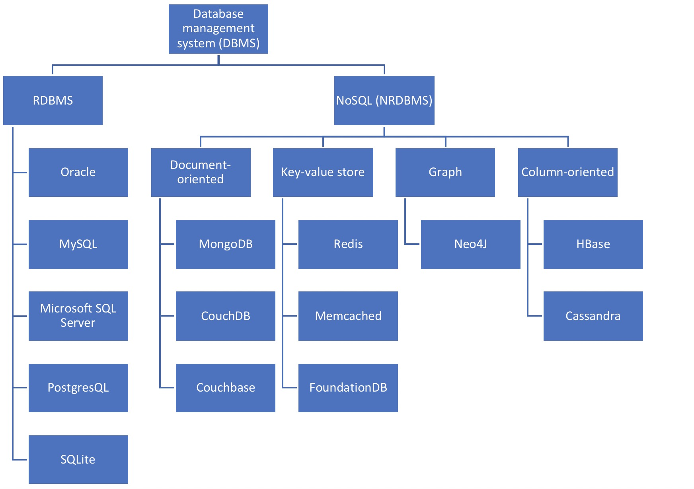

# Contents

At a high level, this walkthrough covers:

1. SQL (a language)
2. Ways in which database systems are designed
3. Three specific database systems (SQLite, PostgreSQL, and MongoDB)
4. The Python interfaces to these 3 systems

# Resources

- CodeAcademy: [list of SQL commands](https://www.codecademy.com/articles/sql-commands?r=master)

- [DB-Engines](https://db-engines.com/en/ranking): ranks database management systems according to their popularity

- [PyMongo](https://api.mongodb.com/python/current/)
- [psycopg](http://initd.org/psycopg/)
- [PostgreSQL 10 documentation](https://www.postgresql.org/docs/10/static/index.html)

- [SQLite](https://www.sqlite.org/index.html)
    - [Command Line Shell For SQLite](https://www.sqlite.org/cli.html)
    - [Books About SQLite](https://www.sqlite.org/books.html)
    - [SQL As Understood By SQLite](https://www.sqlite.org/lang.html)
    - [Core Functions](https://www.sqlite.org/lang_corefunc.html)
    - [Aggregate Functions](https://www.sqlite.org/lang_aggfunc.html)
    - [Date & Time Functions](https://www.sqlite.org/lang_datefunc.html)
    - [Data Types](https://www.sqlite.org/datatype3.html)
    - [Distinctive Features](https://www.sqlite.org/different.html)
    - [sqlitetutorial.net/](http://www.sqlitetutorial.net/)

Books:
- Seven Databases in Seven Weeks - Redmon & Wilson
- Sams Teach Yourself SQL in 10 Minutes - Forta
- Sams Teach Yourself SQL in 24 Hours - Stephens & Plew
- SQLNotesForProfessionals - GoalKicker
- PostgreSQLNotesForProfessionals - GoalKicker
- MongoDBNotesForProfessionals - GoalKicker

# Database design: 10,000-foot View

# SQL

- SQL (Structured Query Language) is a programming language designed to manage data stored in relational databases. SQL operates through simple, declarative statements. This keeps data accurate and secure, and helps maintain the integrity of databases, regardless of size.
- The SQL language is widely used today across web frameworks and database applications.
- Learning SQL itself is a foundation to working with database systems, each of which may utilize its own "variant" of supported SQL statements and syntaxes.

# SQLite

Why SQLite?

- SQLite uses dynamic typing. It does not enforce data type constraints. Data of any type can (usually) be inserted into any column.
- It is open-source, and free.
- Zero configuration.
- It is serverless--not a client-server database engine. Rather, it is embedded into the end program.

## Python Interface: `sqlite3`

# PostgreSQL

## Python Interface: `psycopg`

# MongoDB

## Python Interface: `pymongo`

# Python: `sqlalchemy`

# Glossary

| Term        | Definition |
| ----------- |----------- |
| ACID |  |
| CURD |  |
| DMBS | |
| NRDBMS | |
| RDBMS |  |
| Index | |
| B-tree | |
| ETL | |
| NoSQL | |

# System-to-System Jargon

