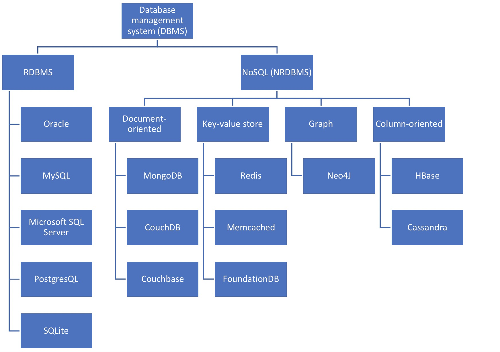

# Contents

At a high level, this walkthrough covers:

1. SQL (a language)
2. Ways in which database systems are designed
3. Three specific database systems (SQLite, PostgreSQL, and MongoDB)
4. The Python interfaces to these 3 systems

# Resources

- CodeAcademy: [list of SQL commands](https://www.codecademy.com/articles/sql-commands?r=master)
- [PL/SQL Reserved Words and Keywords](https://docs.oracle.com/cd/B19306_01/appdev.102/b14261/reservewords.htm)
- Oracle: [Database SQL Language Reference](https://docs.oracle.com/database/121/SQLRF/toc.htm)
- [DB-Engines](https://db-engines.com/en/ranking): ranks database management systems according to their popularity
- [PyMongo](https://api.mongodb.com/python/current/)
- [psycopg](http://initd.org/psycopg/)
- [PostgreSQL 10 documentation](https://www.postgresql.org/docs/10/static/index.html)
    - [Tutorial](https://www.postgresql.org/docs/10/static/tutorial.html)
    - [Meta-commands](https://www.postgresql.org/docs/10/static/app-psql.html) (scroll to bottom of page)
    - [Functions & Operators](https://www.postgresql.org/docs/10/static/functions.html)
- [SQLite](https://www.sqlite.org/index.html)
    - [Command Line Shell For SQLite](https://www.sqlite.org/cli.html)
    - [Books About SQLite](https://www.sqlite.org/books.html)
    - [SQL As Understood By SQLite](https://www.sqlite.org/lang.html)
    - [Core Functions](https://www.sqlite.org/lang_corefunc.html)
    - [Aggregate Functions](https://www.sqlite.org/lang_aggfunc.html)
    - [Date & Time Functions](https://www.sqlite.org/lang_datefunc.html)
    - [Data Types](https://www.sqlite.org/datatype3.html)
    - [Distinctive Features](https://www.sqlite.org/different.html)
    - [sqlitetutorial.net/](http://www.sqlitetutorial.net/)
- [MongoDB docs home](https://docs.mongodb.com/)
    - [Operators](https://docs.mongodb.com/manual/reference/operator/)

Books:
- Seven Databases in Seven Weeks - Redmon & Wilson
- Sams Teach Yourself SQL in 10 Minutes - Forta
- Sams Teach Yourself SQL in 24 Hours - Stephens & Plew
- SQLNotesForProfessionals - GoalKicker
- PostgreSQLNotesForProfessionals - GoalKicker
- MongoDBNotesForProfessionals - GoalKicker

# Database design: 10,000-foot View

Types of database systems:

- **Relational database management systems (RDBMSs)** - set-theory-based systems implemented as two-dimensional tables with rows and columns. The canonical means of interacting with an RDBMS is by
writing queries in Structured Query Language (SQL).  A *relational database* is a collection of linked (related) tables with rows and columns (fields).
- **Key-value store** - a simple model.  As the name implies, a KV store pairs keys to values in much the same way that a map (or hashtable) would in any popular programming language. A filesystem could be considered a key-value store, if you think of the file path as the key and the file contents
as the value.
- **Columnar** (column-oriented, wide column store) - Data from a given column (in the two-dimensional table sense) is stored together. By contrast, a row-oriented database (like an RDBMS) keeps information about a row together.  In column-oriented databases, adding columns is quite inexpensive and is done on a row-by-row basis. Each row can have a different set of columns, or none at all, allowing tables to remain sparse without incurring a storage cost for null values. With respect to structure, columnar is about midway between relational and key-value.
- **Document-oriented** (document store) -In short, a document is like a hash, with a unique ID field and values that may be any of a variety of types, including more hashes. Documents can contain nested structures, and so they exhibit a high degree of flexibility, allowing for variable domains.
- **Graph** - One of the less commonly used database styles, graph databases excel at dealing with highly interconnected data. A graph database consists of nodes and relationships between nodes. Both nodes and relationships can have properties—key-value pairs—that store data. The real strength of graph databases is traversing through the nodes by following relationships.  In other words, they work well with self-referential or otherwise intricately linked data.



What is the client/server model?

- A server process  manages the database files, accepts connections to the database from client applications, and performs database actions on behalf of the clients.
- The user's client (frontend) application wants to perform database operations. Client applications can be very diverse in nature: a client could be a text-oriented tool, a graphical application, a web server that accesses the database to display web pages, or a specialized database maintenance tool.

The client and the server can be on different hosts.  Different systems communicate via different protocols: Postgres via TCP/IP, CouchDB over HTTP, etc.

## Vertical vs. Horizontal Scaling

_Scale_ refers to ability to handle an increasing load without failing.  A well-designed database or application is said to _scale_ well. Relational databases generally scale far better than non-relational databases.

However, MongoDB and other NoSQL designs do scale well _horizontally_.

> Horizontal scaling means that you scale by adding more machines into your pool of resources whereas Vertical scaling means that you scale by adding more power (CPU, RAM) to an existing machine.
>
> In a database world horizontal-scaling is often based on the partitioning of the data i.e. each node contains only part of the data, in vertical-scaling the data resides on a single node and scaling is done through multi-core i.e. spreading the load between the CPU and RAM resources of that machine.

# SQL

*Note*: This section is not intended to be a comprehensive tutorial on the SQL language.  Rather, it "picks and chooses" some syntax & key concepts.

- SQL (Structured Query Language) is a programming language designed to communicate with and manage databases.
- SQL operates through simple, declarative statements. This keeps data accurate and secure, and helps maintain the integrity of databases, regardless of size.
- The SQL language is widely used today across web frameworks and database applications.
- Learning SQL itself is a foundation to working with databases database systems, each of which may utilize its own "extended" SQL statements and variants.
    - Standard SQL is [goverened](http://web.cecs.pdx.edu/~len/sql1999.pdf) by ANSI/ISO/IEC.  All major DBMS support ANSI SQL.

## Lexical Structure

SQL input consists of a sequence of **commands**. A command is composed of a sequence of tokens, terminated by a semicolon. The end of the input stream also terminates a command. Which tokens are valid depends on the syntax of the particular command.

A token can be a **key word, an identifier, a quoted identifier, a literal (or constant), or a special character symbol.** Tokens are normally separated by whitespace (space, tab, newline), but need not be if there is no ambiguity (which is generally only the case if a special character is adjacent to some other token type).

Additionally, comments can occur in SQL input. They are not tokens, they are effectively equivalent to whitespace.

## CRUD

CRUD stands for Create, Read, Update, Delete.  The corresponding SQL functions are:

- `CREATE` & `INSERT` - create a new table and insert new rows into it.
- `SELECT` - query the data (ask questions).
- [`UPDATE`](https://www.postgresql.org/docs/10/static/sql-update.html) - change existing rows.  UPDATE changes the values of the specified columns in all rows that satisfy the condition.
- `DELETE` - delete *rows* from a table.  This is different than dropping the table entirely with `DROP TABLE`.

`UPDATE` examples:

```sql
-- Change the word Drama to Dramatic in the column kind of the table films:
UPDATE films SET kind = 'Dramatic' WHERE kind = 'Drama';

-- Adjust temperature entries and reset precipitation to its default value in one row of the table weather:
UPDATE weather SET temp_lo = temp_lo+1, temp_hi = temp_lo+15, prcp = DEFAULT
  WHERE city = 'San Francisco' AND date = '2003-07-03';

-- Increment the sales count of the salesperson who manages the
-- account for Acme Corporation, using the FROM clause syntax:
UPDATE employees SET sales_count = sales_count + 1 FROM accounts
  WHERE accounts.name = 'Acme Corporation'
  AND employees.id = accounts.sales_person;
```

### More on UPDATE

Basic syntax:

```sql
UPDATE TableName
SET { column_name = { expression | DEFAULT } | ( column_name [, ...] ) = ( sub-SELECT ) } [, ...]
[ FROM from_list ]
[ WHERE condition ]
```

Examples:


> NOTE: The != operator is converted to <> in the parser stage.

Standard SQL operator components:

> \+ - \* / < > = ~ ! @ # % ^ & | \` ?

Keywords are also operators:

- Logical operators: `AND NOT OR`
- Others: `BETWEEN LIKE HAVING IN EXISTS IS [ [NOT] NULL ]`

Syntax for `BETWEEN`:

```sql
SELECT prod_name, prod_price
FROM Products
WHERE prod_price BETWEEN 5 AND 10;
```

Standard truth-tables apply:

| a     | b     | a AND b | a OR b |
| ----- | ----- | ------- | ------ |
| TRUE  | TRUE  | TRUE    | TRUE |
| TRUE  | FALSE | FALSE   | TRUE |
| TRUE  | NULL  | NULL    | TRUE |
| FALSE | FALSE | FALSE   | FALSE |
| FALSE | NULL  | FALSE   | NULL |
| NULL  | NULL  | NULL    | NULL |

and

| a     | NOT a |
| ----- | ----- |
| TRUE  | FALSE |
| FALSE | TRUE |
| NULL  | NULL |

See also: [special characters](https://www.postgresql.org/docs/10/static/sql-syntax-lexical.html#SQL-SYNTAX-SPECIAL-CHARS)

TODO: brackets (Forta p. 59)

## Comments

ANSI SQl and most DBMS support two forms of comments: inline and C-style:

```sql
/* C-style comment
Select the entire table */
SELECT *
FROM Products;  -- Inline comment here
```

## Creating a Table

The simplified syntax is:

```sql
CREATE TABLE [ IF NOT EXISTS ] TableName ( [
    column_name data_type [ default] [ column_constraint [ ... ] ] [, ... ]
] );
```

## Order of Clauses

Clauses associated with `SELECT` must be used in this particular order:

| Clause | Description |
| ------ | ----------- |
| `SELECT` | -- |
| `FROM` | -- |
| `WHERE` | Row-level filtering |
| `GROUP BY` | Group specification |
| `HAVING` | Group-level ordering |
| `ORDER BY` | Output sort order |

Mnemonic: _San Francisco, Where Groupies Hang Out._

From Postgres docs:

> It is important to understand the interaction between aggregates and SQL's WHERE and HAVING clauses. The fundamental difference between WHERE and HAVING is this: **WHERE selects input rows before groups and aggregates are computed (thus, it controls which rows go into the aggregate computation), whereas HAVING selects group rows after groups and aggregates are computed.** Thus, the WHERE clause must not contain aggregate functions; it makes no sense to try to use an aggregate to determine which rows will be inputs to the aggregates. On the other hand, the HAVING clause always contains aggregate functions. (Strictly speaking, you are allowed to write a HAVING clause that doesn't use aggregates, but it's seldom useful. The same condition could be used more efficiently at the WHERE stage.)

In other words, `HAVING` is used to **filter groups**.  `WHERE` doesn't have any concept of a group.  It only filters rows.

To elaborate on the above (specifically, on `GROUP BY`):

- `GROUP BY` instructs the DBMS to group the data and then **perform the aggregate function on each group** rather than on the entire result set.
- `GROUP BY` clauses can contain as many column as you want.
- Aside from the aggregate calculations statements, **every column in your `SELECT` statement must be present in the `GROUP BY` clause**.

## Subqueries

Subquery: a query that is embedded into another query.

- Subqueries are always processed starting with the **innermost** `SELECT` statement and working outward.
- The resulting "inner results" are passed successively to the outer statements.
- Subquery `SELECT` statements can only retrieve a **single column**.

**Examples**:

```sql
brad=# SELECT cust_id
brad-# FROM Orders
brad-# WHERE order_num IN (SELECT order_num
brad(#                     FROM OrderItems
brad(#                     WHERE prod_id = 'RGAN01');
  cust_id
------------
 1000000004
 1000000005
(2 rows)

-- The inner result from above
brad=# SELECT order_num
brad-# FROM OrderItems
brad-# WHERE prod_id = 'RGAN01';
 order_num
-----------
     20007
     20008
(2 rows)
```

You can also **use a subquery as a calculated field**:

```sql
/* Everything inside parentheses behaves like a regular column. */
brad=# SELECT cust_name, cust_state,
brad-#     (SELECT COUNT(*)
brad(#      FROM Orders
brad(#      WHERE Orders.cust_id = Customers.cust_id) AS orders
brad-# FROM Customers
brad-# ORDER BY cust_name;
                     cust_name                      | cust_state | orders
----------------------------------------------------+------------+--------
 Fun4All                                            | IN         |      2
 Fun4All                                            | AZ         |      1
 Kids Place                                         | OH         |      0
 The Toy Store                                      | IL         |      1
 Village Toys                                       | MI         |      3
(5 rows)
```

## Working with `AS`

You cannot reference an alias in a WHERE clause.  **Aliases can only be referenced in GROUP BY, ORDER BY, and HAVING clauses — they can't be used in WHERE clauses.**  (Mnemonic: "get outta here.")

```sql
SELECT order_id, customer_id, YEAR(order_placed_date) AS order_year
FROM orders
WHERE order_year = 2016;  --ERROR 1054

-- The correct query
SELECT order_id, customer_id, YEAR(order_placed_date) AS order_year
FROM orders
WHERE YEAR(order_placed_date) = 2016;
```

## Joins

A Join is created by the DBMS as needed, and it persists (only) for the duration of the query execution.

### Two Ways to Join

```sql
/* Method 1 - with WHERE */
brad=# SELECT vend_name, prod_name, prod_price
brad-# FROM Vendors, Products
brad-# WHERE Vendors.vend_id = Products.vend_id;  -- fully qualified
                     vend_name                      |      prod_name      | prod_price
----------------------------------------------------+---------------------+------------
 Bears R Us                                         | 18 inch teddy bear  |      11.99
 Bears R Us                                         | 12 inch teddy bear  |       8.99
 Bears R Us                                         | 8 inch teddy bear   |       5.99
 Doll House Inc.                                    | Raggedy Ann         |       4.99
 Doll House Inc.                                    | Rabbit bean bag toy |       3.49
 Doll House Inc.                                    | Bird bean bag toy   |       3.49
 Doll House Inc.                                    | Fish bean bag toy   |       3.49
 Fun and Games                                      | Queen doll          |       9.49
 Fun and Games                                      | King doll           |       9.49

/* Method 2 - with JOIN */
brad=# SELECT vend_name, prod_name, prod_price
brad-# FROM Vendors INNER JOIN Products
brad-# ON Vendors.vend_id = Products.vend_id;
```

### Types of Joins

- Inner join (equijoin).  Joins on the **intersection** of rows.  Per the ANSI specification, use of `INNER JOIN` syntax is preferred over the `WHERE` syntax.
- Left outer join.  Will return all results from the left table in your statement, matched against rows in the right table when possible. If a row in the left table does not contain a corresponding match in the right table, it will still be listed — with NULL values in columns for the right table.
- Right outer join.  Like left join, but vice versa.
- Full outer join.  This is a union.  (Not to be confused with UNION keyword.)
- Self join - joining a table against itself
- Cross join - a join with no qualifier.  Returns Cartesian product.  The number of rows in the result is the product of the number of rows in each table.

Example of a self-join (Postgres docs):

```sql
SELECT W1.city, W1.temp_lo AS low, W1.temp_hi AS high,
    W2.city, W2.temp_lo AS low, W2.temp_hi AS high
    FROM weather W1, weather W2
    WHERE W1.temp_lo < W2.temp_lo
    AND W1.temp_hi > W2.temp_hi;

     city      | low | high |     city      | low | high
---------------+-----+------+---------------+-----+------
 San Francisco |  43 |   57 | San Francisco |  46 |   50
 Hayward       |  37 |   54 | San Francisco |  46 |   50
(2 rows)
```

## Transactions

Most commands are implicitly wrapped in transactions.  If you executed a command, such as DELETE FROM account WHERE total < 20;, and the database crashed halfway through the delete, you wouldn’t be stuck with half a table. When you restart the database server, that command will be rolled back.

```sql
BEGIN TRANSACTION;
DELETE FROM events;
ROLLBACK;
SELECT * FROM events;
```

Transactions are useful when you’re modifying two tables that you don’t want out of sync. The classic example is a debit/credit system for a bank, where money is moved from one account to another:

```sql
BEGIN TRANSACTION;
UPDATE account SET total=total+5000.0 WHERE account_id=1337;
UPDATE account SET total=total-5000.0 WHERE account_id=45887;
END;
```

## Subqueries

```sql
-- max cannot be used in the WHERE clause
SELECT city FROM weather
    WHERE temp_lo = (SELECT max(temp_lo) FROM weather);
```

## Primary Keys

Primary key: a special constraint used to ensure that values in a column or set of columns:

- are unique
- never change

Although primary keys are not actually required, it is good practice to always define them explicitly.

Required conditions:

- No two rows can have the same primary key value
- Every row must have a primary key value (cannot be NULL)
- Values in primary key columns should never be modified or updated
- Primary key values should never be re-used if one row is deleted

You can create them via `ALTER TABLE` + `ADD CONSTRAINT` or directly within `CREATE TABLE`:

```sql
-- Option 1
CREATE TABLE Vendors (
    vend_id     CHAR(10)    NOT NULL PRIMARY KEY,
    other       CHAR(50)    NULL,
);

-- Option 2
ALTER TABLE Vendors
ADD CONSTRAINT PRIMARY KEY (vend_id);
```

The latter is disallowed in SQLite.

## Foreign Keys

Foreign key: a column in a table whose values must be listed in a primary key in another table.

**Foreign keys define the arrow relationships found in databse relationship diagrams.**

The entries in a foreign key column are not necessarily unique; just the column that they reference is unique.

An example: a foreign key is defined on the customer ID column in `Orders` so that the column can accept only values that are in the `Customers` table's primary key.

Foreign keys are ceated via either `CREATE TABLE` + `REFERENCES` or `ALTER TABLE` + `ADD CONSTRAINT`.

```sql
CREATE TABLE Orders (
    order_num   INTEGER     NOT NULL PRIMARY KEY,
    order_date  DATETIME    NOT NULL,
    cust_id     CHAR(10))   NOT NULL REFERENCES Customers(cust_id)
);

-- Alternate route
ALTER TABLE Orders
ADD CONSTRAINT
FOREIGN KEY (cust_id) REFERENCES Customers (cust_id);
```

## Unique Constraints

Unique constraint: used to ensure that all data in a column or set of columsn is unique.

- Create via `UNIQUE`
- A table can contain multiple `UNIQUE` columns (but only one primary key)
- Unique constraint columns can contain NULL values
- They can be modified or updated
- They can be reused
- They *cannot* be used to define foreign keys

## Check Constraints

Check constraint: used to ensure that data in a column or set of columns meets a criteria that you specify.

```sql
CREATE TABLE OrderItems (
    order_num    INTEGER    NOT NULL,
    quantity     INTEGER    NOT NULL CHECK (quantity > 0)
);

ADD CONSTRAINT CHECK (gender LIKE '[MF]')
```

## Indexes

Indexes are used to sort data logically to improve the speed of searching and sorting operations.

Primary keys are always *internally* sorted.

You may define an index manually on one or more columns via `CREATE INDEX`; the DBMS will keep a sorted list of the contents internally.

Considerations:

- Indexes improve the performance of retrieval operations, but degrade the performance of data insertion, modification, and deletion.
- Index data can take up lots of storage space.
- Not all data is suitable for indexing.  Data that is not sufficiently unique (State, for example), will not benefit from indexing as much as highly unique data.
- Every index must be uniquely named

Example:

```sql
CREATE INDEX prod_name_ind
ON Products (prod_name);
```

## Views

**A view simply gives a name to a query** that can dymanmically retrieve data when used.

Suppose the combined listing of weather records and city location is of particular interest to your application, but you do not want to type the query each time you need it. You can create a view over the query, which gives a name to the query that you can refer to like an ordinary table:

```sql
CREATE VIEW MyView AS
    SELECT city, temp_lo, temp_hi, prcp, date, location
        FROM Weather, Cities
        WHERE city = name;

SELECT * FROM MyView;
```

A view *does not* contain any data itself; it just contains a query.  Therefore, views are "dynamic," not "static".  Modifiying the underlying table will modify the result of the view:

```sql
brad=# CREATE VIEW AfterQ1 AS
brad-# SELECT * FROM Orders
brad-# WHERE order_date > '2012-03-31';
CREATE VIEW
brad=# SELECT * FROM AfterQ1;
 order_num | order_date |  cust_id
-----------+------------+------------
     20005 | 2012-05-01 | 1000000001
     20010 | 2012-05-15 | 1000000001
(2 rows)

brad=# INSERT INTO Orders
brad-# Values (20011, '2012-05-20', 1000000003);
INSERT 0 1
brad=# SELECT * FROM AfterQ1;
 order_num | order_date |  cust_id
-----------+------------+------------
     20005 | 2012-05-01 | 1000000001
     20010 | 2012-05-15 | 1000000001
     20011 | 2012-05-20 | 1000000003
(3 rows)
```

Another use for views is to reformat retrieved data:

```sql
brad=# CREATE VIEW VendorLocations AS
brad-# SELECT RTRIM(vend_name) || ' ('|| RTRIM(vend_country) || ')'
brad-#     AS vend_title
brad-# FROM Vendors;
CREATE VIEW
brad=# SELECT *
brad-# FROM VendorLocations;
       vend_title
-------------------------
 Bears R Us (USA)
 Bear Emporium (USA)
 Doll House Inc. (USA)
 Furball Inc. (USA)
 Fun and Games (England)
 Jouets et ours (France)
(6 rows)
```

PostgreSQL docs: [views](https://www.postgresql.org/docs/10/static/tutorial-views.html).

> Making liberal use of views is a key aspect of good SQL database design. Views allow you to encapsulate the details of the structure of your tables, which might change as your application evolves, behind consistent interfaces.

*Note*: SQLite supports read-only views.

## Triggers

TODO (see Forta p. 222)

## Cursors

TODO (See Forta, p. 205)

## NULL

`NULL` is a distinct SQL data type, different from the empty string, false, or 0.  It is possible to declare a column as nullable or non-nullable:

```sql
sqlite> CREATE TABLE MyTable (
   ...>     col1 INT NOT NULL,
   ...>     col2 INT NULL
   ...> );

sqlite> INSERT INTO MyTable
   ...> VALUES (1, NULL);

sqlite> SELECT * FROM MyTable;
1|
```

## NULL Behavior With WHERE Clauses

Consider this example:

```sql
brad=# SELECT * FROM WithNulls;
 fielda
--------
      1
      2

      4
      5
(5 rows)

brad=# SELECT * FROM WithNulls
brad-# WHERE fielda = 4;
 fielda
--------
      4
(1 row)

brad=# SELECT * FROM WithNulls
brad-# WHERE fielda != 4;
 fielda
--------
      1
      2
      5
(3 rows)
```

Notice that the NULL result is *not returned in either query.*

When using the SELECT clause with conditions, rows with the NULL value will not match against either the = or the <> operator.

To correct:

```
brad=# SELECT * FROM WithNulls
brad-# WHERE fielda != 4 OR fielda IS NULL;
 fielda
--------
      1
      2

      5
(4 rows)
```

## Conditional Expressions

PostgreSQL: [conditional expressions](https://www.postgresql.org/docs/10/static/functions-conditional.html)

The SQL `CASE` expression is a generic conditional expression, similar to if/else statements in other programming languages:

```sql
CASE WHEN condition THEN result
     [WHEN ...]
     [ELSE result]
END
```

Notice again that this does not account for NULL unless we tell it to.

```sql
brad=# SELECT fielda,
brad-#     CASE WHEN fielda < 3 THEN 'lt'
brad-#          WHEN fielda > 3 THEN 'gt'
brad-#     END
brad-# FROM WithNulls;
 fielda | case
--------+------
      1 | lt
      2 | lt
        |
      4 | gt
      5 | gt
(5 rows)
```

Another example:

```sql
brad=# SELECT CASE WHEN (3 IN (1, 2, 3, NULL)) THEN 'Three is here'
brad-#             ELSE 'Three is not here'
brad-#        END
brad-# AS result;
    result
---------------
 Three is here
(1 row)
```

Again related to NULL behavior, consider the following similar example:

```sql
brad=# SELECT CASE WHEN (3 NOT IN (1, 2, NULL)) THEN 'Three is not here'
brad-#             ELSE 'Three is here'
brad-#        END
brad-# AS result;
    result
---------------
 Three is here
(1 row)
```

This is functionally equivalent to:

```sql
SELECT CASE WHEN ((3 <> 1) AND (3 <> 2) AND (3 <> NULL))
```

In ANSI SQL, we'd need `IS NULL` instead.

## Sortedness

SQL does not make any guarantees about the order of the rows in a table.

SQL query results are not sorted by nature unless you specify such.  Queries may or may not return data in the order it was added to the table.

## Stored Procedures

Stored procedures (SP) - collections of one or more SQL statements saved for future use, stored on the database server and invoked using the interface.  Stored procedures are effectively functions capable of taking positional and keyword arguments.

The syntax varies dramatically from one DBMS to the next.  The standard SQL statement to *execute* (call) a stored procedure is simply `EXECUTE`.

**Note**: SQLite does not support stored procedures.

See also: https://www.postgresql.org/docs/10/static/sql-syntax-calling-funcs.html

```sql
/* Three ways to call functions in Postgres */

CREATE FUNCTION concat_lower_or_upper(a text, b text, uppercase boolean DEFAULT false)
RETURNS text
AS
$$
 SELECT CASE
        WHEN $3 THEN UPPER($1 || ' ' || $2)
        ELSE LOWER($1 || ' ' || $2)
        END;
$$
LANGUAGE SQL IMMUTABLE STRICT;

SELECT concat_lower_or_upper('Hello', 'World');  -- Third argument has default
 concat_lower_or_upper
-----------------------
 hello world
(1 row)

SELECT concat_lower_or_upper(a => 'Hello', b => 'World');  -- Named notation
 concat_lower_or_upper
-----------------------
 hello world
(1 row)

SELECT concat_lower_or_upper('Hello', 'World', uppercase => true);  -- Mixed notation
 concat_lower_or_upper
-----------------------
 HELLO WORLD
(1 row)
```

## `DISTINCT`

```sql
sqlite> SELECT * FROM Products;
prod_id     vend_id     prod_name          prod_price  prod_desc
----------  ----------  -----------------  ----------  --------------------------------------------
BR01        BRS01       8 inch teddy bear  5.99        8 inch teddy bear, comes with cap and jacket
BR02        BRS01       12 inch teddy bea  8.99        12 inch teddy bear, comes with cap and jacke
BR03        BRS01       18 inch teddy bea  11.99       18 inch teddy bear, comes with cap and jacke
BNBG01      DLL01       Fish bean bag toy  3.49        Fish bean bag toy, complete with bean bag wo
BNBG02      DLL01       Bird bean bag toy  3.49        Bird bean bag toy, eggs are not included
BNBG03      DLL01       Rabbit bean bag t  3.49        Rabbit bean bag toy, comes with bean bag car
RGAN01      DLL01       Raggedy Ann        4.99        18 inch Raggedy Ann doll
RYL01       FNG01       King doll          9.49        12 inch king doll with royal garments and cr
RYL02       FNG01       Queen doll         9.49        12 inch queen doll with royal garments and c

sqlite> SELECT DISTINCT vend_id, prod_price
   ...> FROM Products;
vend_id     prod_price
----------  ----------
BRS01       5.99
BRS01       8.99
BRS01       11.99
DLL01       3.49
DLL01       4.99
FNG01       9.49

/* Operates on both columns at once */
sqlite> SELECT DISTINCT vend_id, prod_desc
   ...> FROM Products;
vend_id     prod_desc
----------  --------------------------------------------
BRS01       8 inch teddy bear, comes with cap and jacket
BRS01       12 inch teddy bear, comes with cap and jacke
BRS01       18 inch teddy bear, comes with cap and jacke
DLL01       Fish bean bag toy, complete with bean bag wo
DLL01       Bird bean bag toy, eggs are not included
DLL01       Rabbit bean bag toy, comes with bean bag car
DLL01       18 inch Raggedy Ann doll
FNG01       12 inch king doll with royal garments and cr
FNG01       12 inch queen doll with royal garments and c
```

## `OFFSET` & `COUNT`

`OFFSET`: "start from" the specified row.

- `COUNT(COLUMN_NAME)` will count only non-null entries;
- `COUNT(*)` will count nulls also.

```sql
brad=# CREATE TABLE OneCol (
brad(#     col INT
brad(# );

brad=# INSERT INTO OneCol
brad-# VALUES (1), (2), (NULL), (4);

brad=# SELECT * FROM ONECOL;
 col
-----
   1
   2

   4
(4 rows)

brad=# SELECT COUNT(*)      -- Counts NULL
brad-# FROM OneCol;
 count
-------
     4
(1 row)

brad=# SELECT COUNT(col)    -- Ignores NULL
brad-# FROM OneCol;
 count
-------
     3
(1 row)

/*
OFFSET says to skip that many rows before beginning to return rows.
I.e. it's 0-indexed.
*/
brad=# SELECT *
brad-# FROM OneCol
brad-# OFFSET (
brad(#     SELECT COUNT(*) - 1
brad(#     FROM ONECOL
brad(# );
 col
-----
   4
(1 row)
```

## Other Tricks

`ORDER BY` can use 1-indexed column *positions*:

```sql
brad=# SELECT *
brad-# FROM Orders
brad-# ORDER BY 3, 2;
 order_num | order_date |  cust_id
-----------+------------+------------
     20009 | 2012-02-08 | 1000000001
     20005 | 2012-05-01 | 1000000001
     20010 | 2012-05-15 | 1000000001
     20006 | 2012-01-12 | 1000000003
     20011 | 2012-05-20 | 1000000003
     20007 | 2012-01-30 | 1000000004
     20008 | 2012-02-03 | 1000000005
(7 rows)
```

# SQLite

Why SQLite?

- SQLite uses dynamic typing. It does not enforce data type constraints. Data of any type can (usually) be inserted into any column.
- It is open-source, and free.
- Zero configuration.
- It is serverless--not a client-server database engine. Rather, it is embedded into the end program.

There are limitations to the serverless configuration above.  Client/server systems can handle multiple concurrent connections from clients; SQLite cannot.

## SQLite3

SQLite is generally intended to be used within other languages and applications rather than as a standalone database.

Its command-line utility that can be used to execute SQL statements against a SQLIte database is sqlite3.

## Useful Dot-Commands (Alphabetized)

This list is _not_ exhaustive; full list [here](https://www.sqlite.org/cli.html#special_commands_to_sqlite3_dot_commands_).

| Commmand | Use | Example |
| :------- | :-- | :------ |
| `.cd DIRECTORY` | Change the working directory to `DIRECTORY` | |
| `.databases` | List names and files of attached databases | |
| `.exit` or `.quit` | Exit sqlite3 | |
| `.headers [on or off]` | Turn display of headers on or off | |
| `.help` | Show all dot-commands. | |
| `.import FILE TABLE` | Takes 2 arguments.  Import data from `FILE` into `TABLE`.  `FILE` is the name of the disk file from which data is to be read.  It could be CSV data. `TABLE` is the name of the _table_ (not database) into which the file will be read.  Note with CSV data you may need to specify `.separator ,` first.  | `sqlite> .import C:/work/somedata.csv tab1` |
| `.mode` | Change output mode: one of `ascii column csv html insert line list quote tabs tcl` | |
| `.once (-e or-x or FILE)` | Output for the next SQL command only to `FILE`. | |
| `.open ?OPTIONS? ?FILE?` | Close existing database and reopen `FILE`; The `--new` option starts with an empty file.  This _uses a persistent disk file as the database._ | `sqlite> .open ex1.db`; `sqlite> .open tysql.sqlite teach` |
| `.output ?FILE?` | Send output to `FILE` or stdout.  Use `.output` with no arguments to begin writing to standard output (again). | |
| `.read FILENAME` | Execute SQL in `FILENAME` | |
| `.separator COL ?ROW?` | Change the column separator and optionally the row.  This is separator for both the output mode and `.import`. | `separator ,` |
| `.tables` | List names of tables | |
| `.width NUM1 NUM2 ...` | Set column widths for "column" mode; Negative values right-justify | |

## File extensions

- `.sqlite`, `.sqlite3`, `.db` - *binary* database files (don't view them in a text editor).  You use `.open <file>` on these.  `.db` and `.sqlite` extensions are functionally equivalent; `.sqlite` denotes a SQLite databse, while `.db` is used by Oracle and others.  The content itself is determined by a sequence of bytes; the first 100 bytes of the database file comprise the database file header.
- `.sql` - written in ASCII; commonly contains _queries _but could also _create tables_ themselves.

## `import` versus `read` versus `open`

- `.import FILE TABLE`: Import data from `FILE` into `TABLE`.  Use this with delimited data, not `.sqlite` or `.db` files.
- `.read FILENAME`:  Execute SQL in `FILENAME`.
- `.open ?OPTIONS? ?FILE?`: This _uses a persistent disk file as the database._

## Python Interface: sqlite3

Not to be confused with the command-line tool, sqlite3 is also the name of the module in Python's standard library for interfacing with SQLite database.

# PostgreSQL

TODO: PL/pgSQL procedural language

Pronounced: "Post-greS-Q-L" or just "Postgres."  Works well for "Stepford data"--data that is fairly homogeneous and conforms well to a structured schema.  Written in and scriptable with JavaScript.

Max OSX installation and server startup with Homebrew:

```bash
brew install postgresql
brew services start postgresql
```

Each table is a named collection of rows. Each row of a given table has the same set of named columns, and each column is of a specific data type. Whereas columns have a fixed order in each row, it is important to remember that SQL does not guarantee the order of the rows within the table in any way (although they can be explicitly sorted for display).

Tables are grouped into databases, and a collection of databases managed by a single PostgreSQL server instance constitutes a database cluster.

**`psql`** is the interactive PostgresQL terminal-based front-end, a command-line utility.

Postgres provides a back-end server that does all of the work and `psql` to connect to the running server. The server communicates through port 5432 by default, which you can connect to with the psql shell.

To load a specific database, use `psql database`; otherwise, you can use just `psql`.  With no arguments, the default database is your operating-system user name.

Helpful flag is `-s` to use single-step mode:

```sql
 ~$ psql -s
psql (10.3)
Type "help" for help.

brad=# \cd /Users/brad/Scripts/sql/tutorial/
brad=# \i basics.sql
***(Single step mode: verify command)*******************************************
CREATE TABLE weather (
    city        varchar(80),
    temp_lo     int,
    temp_hi     int,
    prcp        real,
    date        date
);
***(press return to proceed or enter x and return to cancel)********************
```

Docstring [syntax](https://www.postgresql.org/docs/10/static/notation.html) (i.e. `mydb=# \h CREATE TABLE`):

> The following conventions are used in the synopsis of a command: brackets ([ and ]) indicate optional parts. (In the synopsis of a Tcl command, question marks (?) are used instead, as is usual in Tcl.) Braces ({ and }) and vertical lines (|) indicate that you must choose one alternative. Dots (...) mean that the preceding element can be repeated.

Create or drop a database from command line:

```bash
 ~$ createdb book
 ~$ psql book
psql (10.3)
Type "help" for help.

book=# \q
 ~$ dropdb book
```

Or, from `psql`:

```sql
 ~$ psql
psql (10.3)
Type "help" for help.

brad=# CREATE DATABASE endor;
CREATE DATABASE
brad=# \connect endor;
You are now connected to database "endor" as user "brad".
endor=# \l
                              List of databases
   Name    | Owner | Encoding |   Collate   |    Ctype    | Access privileges
-----------+-------+----------+-------------+-------------+-------------------
 brad      | brad  | UTF8     | en_US.UTF-8 | en_US.UTF-8 |
 endor     | brad  | UTF8     | en_US.UTF-8 | en_US.UTF-8 |
```

## Meta-commands

Anything you enter in psql that begins with an unquoted backslash is a psql meta-command that is processed by psql itself. These commands make psql more useful for administration or scripting. Meta-commands are often called slash or backslash commands.

| Command | Use |
| ------- | --- |
| `\c or \connect` | Establishes a new connection to a PostgreSQL server. Full syntax: `\c or \connect [ -reuse-previous=on|off ] [ dbname [ username ] [ host ] [ port ] | conninfo ]`.
| `\cd [ directory ]` | Changes the current working directory to directory. Without argument, changes to the current user's home directory. |
| `\conninfo` | Outputs information about the current database connection. |
| `\d[S+] ` | Prints a table of **relations**.  A relation may be a table, view, materialized view, index, sequence, or foreign table.  Plus symbol gives more detailed output. |
| `\dt[+]` | List tables only. Instead of `t`, you could also use E, i, m, s, t, and v, which stand for foreign table, index, materialized view, sequence, table, and view, respectively. |
| `\echo` | Like the bash command.  Prints the arguments to the standard output, separated by one space and followed by a newline. This can be useful to intersperse information in the output of scripts. |
| `\h` or `\help [ command ]` | Gives syntax help on the specified SQL command. If command is not specified, then psql will list all the commands for which syntax help is available. |
| `\H` or `\html` | Toggle HTML output format. |
| `\i` or `\include filename` | Reads input from the file filename and executes it as though it had been typed on the keyboard. |
| `\l[+]` | List the databases in the server and show their names, owners, character set encodings, and access privileges. |
| `\q` or `\quit` | Quits the psql program. In a script file, only execution of that script is terminated. |
| `\s [filename]` | Print psql's command line history to filename. If filename is omitted, the history is written to the standard output (using the pager if appropriate). |
| `\timing [ on/off ]` | With a parameter, turns displaying of how long each SQL statement takes on or off. Without a parameter, toggles the display between on and off. |
| `\! [ command ]` | With no argument, escapes to a sub-shell; psql resumes when the sub-shell exits. With an argument, executes the shell command command. |
| `\? [ topic ]` | Shows help information about `psql`-specific commands.  (Whereas `\h` covers more SQL commands.) |

Examples

```sql
book=# \conninfo
You are connected to database "book" as user "brad" via socket in "/tmp" at port "5432".

book=# \!
bash-3.2$ pwd
/Users/brad
bash-3.2$ exit
exit

book=# \dp
                                     Access privileges
 Schema |        Name         |   Type   | Access privileges | Column privileges | Policies
--------+---------------------+----------+-------------------+-------------------+----------
 public | cities              | table    |                   |                   |
 public | countries           | table    |                   |                   |
 public | events              | table    |                   |                   |
 public | events_event_id_seq | sequence |                   |                   |
 public | holidays            | view     |                   |                   |
 public | venues              | table    |                   |                   |
 public | venues_venue_id_seq | sequence |                   |                   |
(7 rows)

book=# \dt
         List of relations
 Schema |   Name    | Type  | Owner
--------+-----------+-------+-------
 public | cities    | table | brad
 public | countries | table | brad
 public | events    | table | brad
 public | venues    | table | brad
(4 rows)

book=# \l
                              List of databases
   Name    | Owner | Encoding |   Collate   |    Ctype    | Access privileges
-----------+-------+----------+-------------+-------------+-------------------
 book      | brad  | UTF8     | en_US.UTF-8 | en_US.UTF-8 |
 postgres  | brad  | UTF8     | en_US.UTF-8 | en_US.UTF-8 |
 template0 | brad  | UTF8     | en_US.UTF-8 | en_US.UTF-8 | =c/brad          +
           |       |          |             |             | brad=CTc/brad
 template1 | brad  | UTF8     | en_US.UTF-8 | en_US.UTF-8 | =c/brad          +
           |       |          |             |             | brad=CTc/brad
(4 rows)

book=# \timing on
Timing is on.
```

## Recognized Data Types

Postgres supports native SQL types and engineers a bunch of its own:

> https://www.postgresql.org/docs/10/static/datatype.html

Some of the frequently used data types are `integer` for whole numbers, `numeric` for possibly fractional numbers, `text` for character strings, `date` for dates, `time` for time-of-day values, and `timestamp` for values containing both date and time.

## Reading From Delimited File

Use `COPY`:

```sql
brad=# COPY weather FROM '/home/brad/weather.txt';
brad=# COPY ewoks FROM '/path/to/ewoks.csv' DELIMITER ',' CSV HEADER;
```

## Aliasing

`AS` is not required with Postgres:

```sql
SELECT *
    FROM weather w, cities c
    WHERE w.city = c.name;
```

## Window Functions

Window functions are not very common between DBMS.  (PostgreSQL is one of the few open source databases to implement them).

Window functions are similar to GROUP BY queries in that they allow you to run aggregate functions across multiple rows. **The difference is that they allow you to use built-in aggregate functions without requiring every single field to be grouped to a single row.**

## Python Interface: psycopg

# MongoDB

## About MongoDB

- JSON (technically BSON--binary JSON) document database
- First publicly released in 2009
- Designed as a scalable database--the name Mongo comes from "humongous"
- Allows data to persist in a nested state
- Enforces no schema, so documents can optionally contain fields or types that no other document in the collection contains
- Defaults to lazy evaluation

There are two main data structures in MongoDB:

- An object (hashtable or map), constructed with and denoted by braces, {}
- An array, constructed with/denoted by brackets, []

## ObjectID

Each document has an ObjectID, a 12-byte value composed of:

- A 4-byte value representing the seconds since the Unix epoch,
- A 3-byte machine identifier,
- A 2-byte process id, and
- A 3-byte counter, starting with a random value.

## Querying Documents

Querying documents:

- [Basic Queries](https://docs.mongodb.com/manual/tutorial/query-documents/)
- [Query on Embedded/Nested Documents](https://docs.mongodb.com/manual/tutorial/query-embedded-documents/)
- [Query an Array](https://docs.mongodb.com/manual/tutorial/query-arrays/)
- [Query an Array of Embedded Documents](https://docs.mongodb.com/manual/tutorial/query-array-of-documents/)
- [Query for Null or Missing Fields](https://docs.mongodb.com/manual/tutorial/query-for-null-fields/)

The `db.collection.find()` method returns a **cursor** to the matching documents.  A cursor is a pointer to the result set of a query. Clients can iterate through a cursor to retrieve results.

```javascript
-- Select all documents in a collection
-- Braces are optional in mongo, not in pymongo
db.inventory.find( {} )

-- Match a single top-level field
-- Most basic syntax
db.inventory.find( { status: "D" } )

-- Match a nested field
db.inventory.find( { "size.uom": "in" } )

-- Match a nested document
db.inventory.find( { size: { h: 14, w: 21, uom: "cm" } } )

-- Match an array that contains an element
-- These are equivalent (in this specific case)
> db.inventory.find( { tags: "red" } )
> db.inventory.find( { tags : { $in : ["red"] } } )
```

## mongo, mongod, and mongodb

mongoDB is server/client.

- `mongod`: The database server.  Stands for mongo daemon.  It _instantiates the MongoDB server_.  Default params are storing data in `/data/db` and running on port 27017.
- `mongo`: The database client.  Command line shell that connects to a mongod instance.

## Python Interface: pymongo

## SQL-to-Mongo Phrasebook

| SQL | MongoDB |
| --- | ------- |
| Database | Database |
| Table | Collection |
| Row | Document |
| Column | Field |
| Index | Index |

# Python: sqlalchemy

# Glossary

| Term        | Definition |
| ----------- |----------- |
| ACID | stands for Atomic (all ops succeed or none do), Consistent (the data will always be in a good state—no inconsistent states), Isolated (transactions don’t interfere), and Durable (a committed transaction is safe, even after a server crash). |
| CRUD | CRUD is a useful mnemonic for remembering the basic data management operations: Create, Read, Update, and Delete. These generally correspond to inserting new records (creating), modifying existing records (updating), and removing records you no longer need (deleting). All of the other operations you use a database for (any crazy query you can dream up) are read operations. |
| DMBS | Database management system.  A database software that creates and manipulates a database. |
| NRDBMS | |
| RDBMS |  |
| Index | |
| B-tree | |
| ETL | |
| NoSQL | "Not only SQL."  |
| ERD | Entity relationship diagram |
| Vendor lock | Companies sell proprietary software and then take advantage to lock in the client, create a reliance, and charge continual fees. |
| Schema | Information about database and table layout and properties. |
| Relation | A mathematical (and broader) term for _table_.
| Qualify | To preface column names with the table within a `SELECT` statement, as in `SELECT weather.city,...`. _Fully qualifying_ a column name is to use the `table.column` syntax. |
| Database | A collection of data stored in some organized fashion |
| Record | Alias for a table _row_. |
| Referential integrity | The concept of ensuring that only valid data is inserted into tables.  Referential integrity is maintained by specifying **foreign keys**, ensuring that inserted values exist in another table.  In other words, DBMSs enforce referential integrity by imposing constraints on database tables. |
| Calculated field | A column created on-the-fly with a SQL `SELECT` statement.  A means of retrieving converted, calculated, or reformatted data directly from the database.  A calculated field does not actually exist itself in the database. |
| Aggregate function | A function that operates on a set of rows to calculate and return a **single value**. |
| Derived field | Another term for **alias**. |
| Alias | An alternate name for a field or value, assigned with the `AS` keyword in ANSI SQL. |
| Scale | Ability to handle an increasing load without failing.  A well-designed database or application is said to _scale_ well. Relational databases scale far better than non-relational databases. [Forta] |

